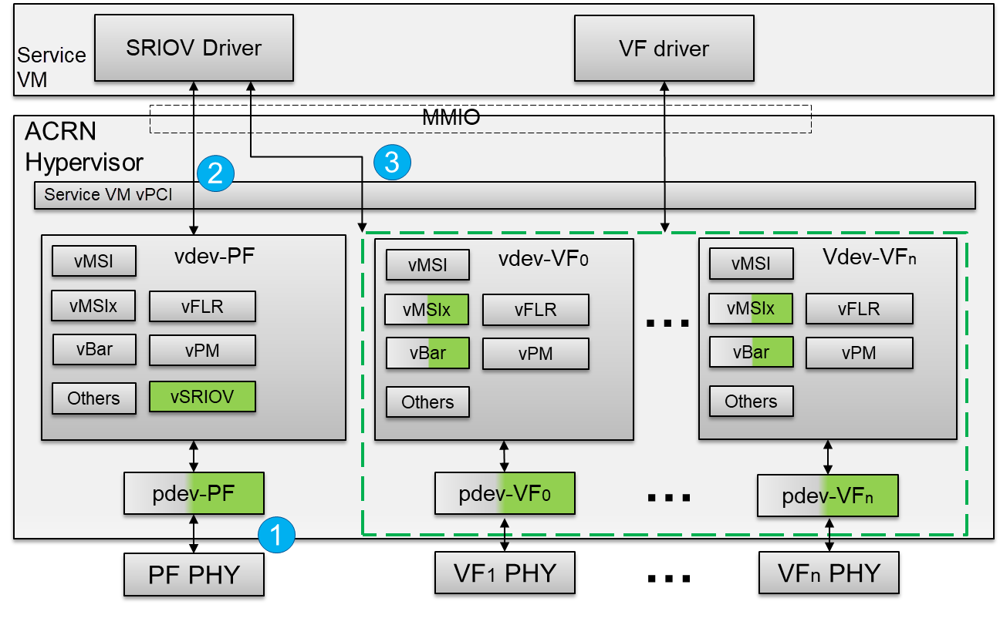
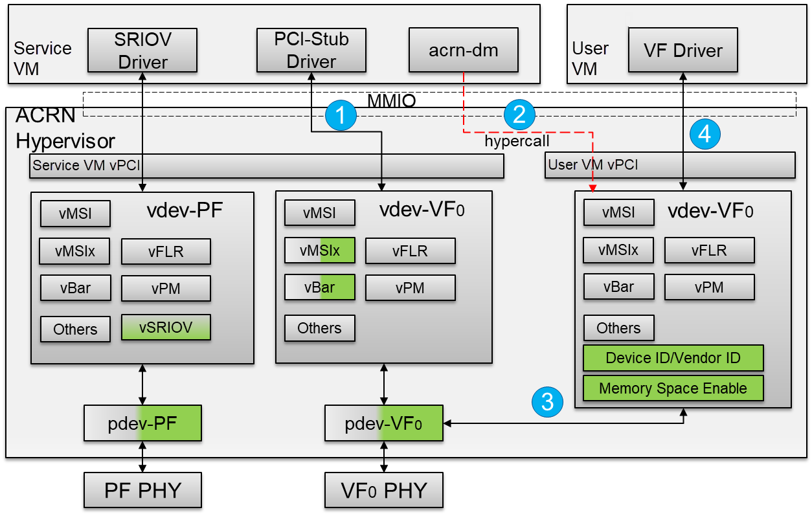
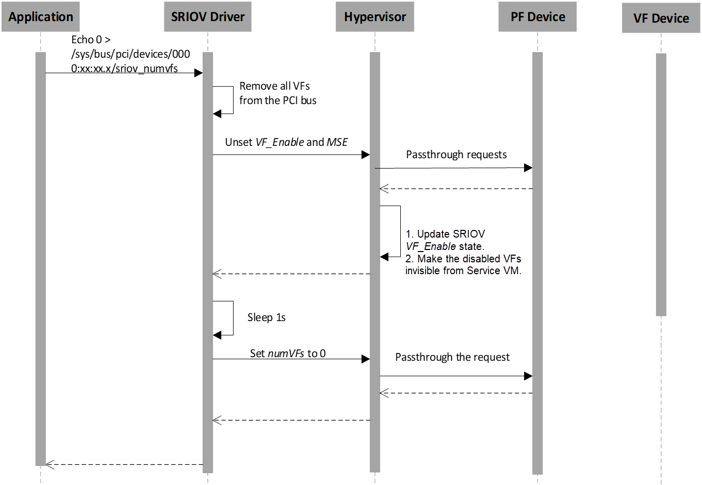

.. _sriov_virtualization:

Enable SR-IOV Virtualization
############################

SR-IOV (Single Root Input/Output Virtualization) can isolate PCIe devices
to improve performance that is similar to bare-metal levels. SR-IOV consists
of two basic units: PF (Physical Function), which supports SR-IOV PCIe
extended capability and manages entire physical devices; and VF (Virtual
Function), a "lightweight" PCIe function that is a passthrough device for
VMs.

For details, refer to Chapter 9 of PCI-SIG's
`PCI Express Base Specification Revision 4.0, Version 1.0
<https://pcisig.com/pci-express-architecture-configuration-space-test-specification-revision-40-version-10>`_.

SR-IOV Architectural Overview
*****************************

.. figure:: images/sriov-image1.png
   :align: center
   :name: SR-IOV-architecture-overview

   SR-IOV Architectural Overview

-  **SI** - A System Image known as a VM.

-  **VI** - A Virtualization Intermediary known as a hypervisor.

-  **SR-PCIM** - A Single Root PCI Manager; it is a software entity for
   SR-IOV management.

-  **PF** - A PCIe Function that supports the SR-IOV capability
   and is accessible to an SR-PCIM, a VI, or an SI.

-  **VF** - A "light-weight" PCIe Function that is directly accessible by an
   SI.

SR-IOV Extended Capability
--------------------------

The SR-IOV Extended Capability defined here is a PCIe extended
capability that must be implemented in each PF device that supports the
SR-IOV feature. This capability is used to describe and control a PF's
SR-IOV capabilities.

.. figure:: images/sriov-image2.png
   :align: center
   :name: SR-IOV-extended-capability

   SR-IOV Extended Capability

-  **PCIe Extended Capability ID** - 0010h.

-  **SR-IOV Capabilities** - VF Migration-Capable and ARI-Capable.

-  **SR-IOV Control** - Enable/Disable VFs; VF migration state query.

-  **SR-IOV Status** - VF Migration Status.

-  **Initial VFs** - Indicates to the SR-PCIM the number of VFs that are
   initially associated with the PF.

-  **Total VFs** - Indicates the maximum number of VFs that can be
   associated with the PF.

-  **Num VFs** - Controls the number of VFs that are visible. *Num VFs* <=
   *Initial VFs* = *Total VFs*.

-  **Function Link Dependency** - The field used to describe
   dependencies between PFs. VF dependencies are the same as the
   dependencies of their associated PFs.

-  **First VF Offset** - A constant that defines the Routing ID
   offset of the first VF that is associated with the PF that contains
   this Capability structure.

-  **VF Stride** - Defines the Routing ID offset from one VF to the
   next one for all VFs associated with the PF that contains this
   Capability structure.

-  **VF Device ID** - The field that contains the Device ID that should be
   presented for every VF to the SI.

-  **Supported Page Sizes** - The field that indicates the page sizes
   supported by the PF.

-  **System Page Size** - The field that defines the page size the system
   will use to map the VFs' memory addresses. Software must set the
   value of the *System Page Size* to one of the page sizes set in the
   *Supported Page Sizes* field.

-  **VF BARs** - Fields that must define the VF's Base Address
   Registers (BARs). These fields behave as normal PCI BARs.

-  **VF Migration State Array Offset** - Register that contains a
   PF BAR relative pointer to the VF Migration State Array.

-  **VF Migration State Array** - Located using the VF Migration
   State Array Offset register of the SR-IOV Capability block.

For details, refer to the *PCI Express Base Specification Revision 4.0, Version 1.0 Chapter 9.3.3*.

SR-IOV Architecture in ACRN
---------------------------

   SR-IOV Architectural in ACRN

1. A hypervisor detects an SR-IOV capable PCIe device in the physical PCI
   device enumeration phase.

2. The hypervisor intercepts the PF's SR-IOV capability and accesses whether
   to enable/disable VF devices based on the ``VF_ENABLE`` state. All
   read/write requests for a PF device passthrough to the PF physical
   device.

3. The hypervisor waits for 100ms after ``VF_ENABLE`` is set and initializes
   VF devices. The differences between a normal passthrough device and
   SR-IOV VF device are physical device detection, BARs, and MSI-X
   initialization. The hypervisor uses ``Subsystem Vendor ID`` to detect the
   SR-IOV VF physical device instead of ``Vendor ID`` since no valid
   ``Vendor ID`` exists for the SR-IOV VF physical device. The VF BARs are
   initialized by its associated PF's SR-IOV capabilities, not PCI
   standard BAR registers. The MSI-X mapping base address is also from the
   PF's SR-IOV capabilities, not PCI standard BAR registers.

SR-IOV Passthrough VF Architecture in ACRN
------------------------------------------

   SR-IOV VF Passthrough Architecture in ACRN

1. The SR-IOV VF device needs to bind the PCI-stud driver instead of the
   vendor-specific VF driver before the device passthrough.

2. The user configures the ``acrn-dm`` boot parameter with the passthrough
   SR-IOV VF device. When the User VM starts, ``acrn-dm`` invokes a
   hypercall to set the *vdev-VF0* device in the User VM.

3. The hypervisor emulates ``Device ID/Vendor ID`` and ``Memory Space Enable
   (MSE)`` in the configuration space for an assigned SR-IOV VF device. The
   assigned VF ``Device ID`` comes from its associated PF's capability. The
   ``Vendor ID`` is the same as the PF's ``Vendor ID`` and the ``MSE`` is always
   set when reading the SR-IOV VF device's control register.

4. The vendor-specific VF driver in the target VM probes the assigned SR-IOV
   VF device.

SR-IOV Initialization Flow
--------------------------

.. figure:: images/sriov-image5.png
   :align: center
   :name: SR-IOV-init-flow

   SR-IOV Initialization Flow

When an SR-IOV capable device is initialized, all access to the
configuration space will passthrough to the physical device directly.
The Service VM can identify all capabilities of the device from the SR-IOV
extended capability and then create a *sysfs* node for SR-IOV management.

SR-IOV VF Enable Flow
---------------------

.. figure:: images/sriov-image6.png
   :align: center
   :width: 900px
   :name: SR-IOV-enable-flow

   SR-IOV VF Enable Flow

The application enables ``n`` VF devices via an SR-IOV PF device ``sysfs`` node.
The hypervisor intercepts all SR-IOV capability access and checks the
``VF_ENABLE`` state. If ``VF_ENABLE`` is set, the hypervisor creates n
virtual devices after 100ms so that VF physical devices have enough time to
be created. The Service VM waits 100ms and then only accesses the first VF
device's configuration space including Class Code, Reversion ID, Subsystem
Vendor ID, Subsystem ID. The Service VM uses the first VF device
information to initialize subsequent VF devices.

SR-IOV VF Disable Flow
----------------------

   SR-IOV VF Disable Flow

The application disables SR-IOV VF devices by writing zero to the SR-IOV PF
device ``sysfs`` node. The hypervisor intercepts all SR-IOV capability
accesses and checks the ``VF_ENABLE`` state. If ``VF_ENABLE`` is clear, the
hypervisor makes VF virtual devices invisible from the Service VM so that all
access to VF devices will return ``0xFFFFFFFF`` as an error. The VF physical
devices are removed within 1s of when ``VF_ENABLE`` is clear.

SR-IOV VF Assignment Policy
---------------------------

.. figure:: images/sriov-image8.png
   :align: center
   :name: SR-IOV-vf-assignment

   SR-IOV VF Assignment

1. All SR-IOV PF devices are managed by the Service VM.

2. The SR-IOV PF cannot passthrough to the User VM.

3. All VFs can passthrough to the User VM, but we do not recommend
   a passthrough to high privilege VMs because the PF device may impact
   the assigned VFs' functionality and stability.

SR-IOV Usage Guide in ACRN
--------------------------

We use the Intel 82576 NIC as an example in the following instructions. We
only support LaaG (Linux as a Guest).

1. Ensure that the 82576 VF driver is compiled into the User VM Kernel
   (set ``CONFIG_IGBVF=y`` in the Kernel Config).

#. When the Service VM boots, the ``lspci -v`` command indicates
   that the Intel 82576 NIC devices have SR-IOV capability and their PF
   drivers are ``igb``.

   .. figure:: images/sriov-image9.png
      :align: center
      :name: 82576-pf

      82576 SR-IOV PF Devices

#. Input the ``echo n > /sys/class/net/enp109s0f0/device/sriov\_numvfs``
   command in the Service VM to enable n VF devices for the first PF
   device (\ *enp109s0f0)*. The number *n* can't be more than *TotalVFs*
   coming from the return value of command
   ``cat /sys/class/net/enp109s0f0/device/sriov\_totalvfs``. Here we
   use *n = 2* as an example.

   .. figure:: images/sriov-image10.png
      :align: center
      :name: 82576-vf

      82576 SR-IOV VF Devices

   .. figure:: images/sriov-image11.png
      :align: center
      :name: 82576-vf-nic

      82576 SR-IOV VF NIC

#. Passthrough an SR-IOV VF device to guest.

   a. Unbind the igbvf driver in the Service VM.

      i.   ``modprobe pci\_stub``

      ii.  ``echo "8086 10ca" > /sys/bus/pci/drivers/pci-stub/new\_id``

      iii. ``echo "0000:6d:10.0" > /sys/bus/pci/devices/0000:6d:10.0/driver/unbind``

      iv.  ``echo "0000:6d:10.0" > /sys/bus/pci/drivers/pci-stub/bind``

   b. Add the SR-IOV VF device parameter (``-s X, passthru,6d/10/0``) in
      the launch User VM script

      .. figure:: images/sriov-image12.png
         :align: center
         :name: 82576-nic-passthru

         Configure 82576 NIC as a Passthrough Device

   c. Boot the User VM

SR-IOV Limitations in ACRN
--------------------------

1. The SR-IOV migration feature is not supported.

2. If an SR-IOV PF device is detected during the enumeration phase, but
   not enough room exists for its total VF devices, the PF device will be
   dropped. The platform uses the ``MAX_PCI_DEV_NUM`` ACRN configuration to
   support the maximum number of PCI devices. Make sure ``MAX_PCI_DEV_NUM`` is
   more than the number of all PCI devices, including the total SR-IOV VF
   devices.
