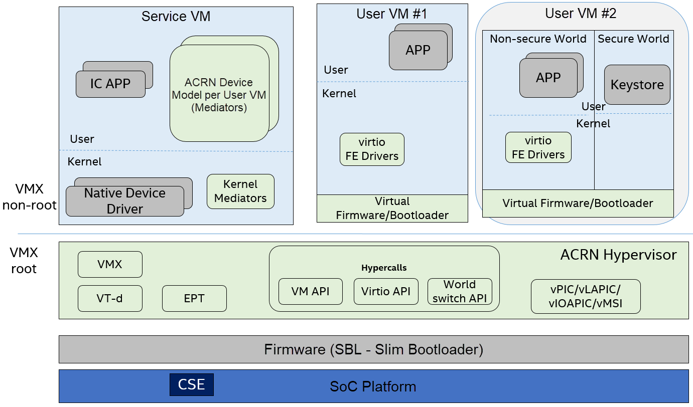

.. _trusty-security-services:

Trusty and Security Services in ACRN
####################################

This document provides an overview of the Trusty architecture for
Linux-based system, what security services Trusty provides, and how
Trusty works on top of the ACRN Hypervisor.

Trusty Architecture
*******************

Trusty is a set of software components supporting a Trusted Execution
Environment (TEE) on embedded devices. It is a full software stack
environment including OS, services, and APIs.
As shown in :numref:`trusty-arch` below, it consists of:

-  An operating system (the Trusty OS) that runs on a processor
   providing a TEE;
-  Drivers for the kernel (Linux) to facilitate communication with
   applications running under the Trusty OS;
-  A set of libraries for Android systems software to facilitate
   communication with trusted applications executed within the Trusty OS
   using the kernel drivers.

   Trusty Architecture

Google provides an Android Open Source Project (AOSP) implementation of
Trusty based on ARM TrustZone technology. Intel enables Trusty
implementation on x86 based platforms with hardware virtualization
technology (e.g. VT-x and VT-d). In :numref:`trusty-arch` above, the
Secure Monitor is a VMM hypervisor. It could be any x86 hypervisor, and
it is the customer's responsibility to pick the right hypervisor for
their product. Intel has developed a product-quality open source
lightweight hypervisor reference implementation for customers to use;
see https://github.com/intel/ikgt-core/tree/trusty.

The purpose of this secure monitor (hypervisor) is to isolate the normal
and secure worlds, and to schedule Trusty OS in and out on demand. In
the Trusty implementation, all the security services provided by Trusty
OS in the secure world are event-driven. As long as there is no service
request from normal world, Trusty OS won't be scheduled in by the
hypervisor. The normal world and secure world share the same processor
resources, so this minimizes the context switching performance penalty.

In Trusty OS, the kernel is a derivative of the `Little Kernel project
<https://github.com/littlekernel/lk/wiki/Introduction>`_,
an embedded kernel supporting multi-thread, interrupt management, MMU,
scheduling, and more. Google engineers added user-mode application
support and a syscall layer to support privilege level isolation, so
that each Trusted App can run in an isolated virtual address space to
enhance application security. Intel added many more security
enhancements such as SMEP (Supervisor Mode Execution Prevention), SMAP
(Supervisor Mode Access Prevention), NX (Non-eXecution), ASLR (Address
Space Layout Randomization), and stack overflow protector.

There are a couple of built-in Trusted Apps running in user mode of
Trusty OS. However, an OEM can add more Trusted Apps in Trusty OS to
serve any other customized security services.For security reasons and
for serving early-boot time security requests (e.g. disk decryption),
Trusty OS and Apps are typically started before Normal world OS.

In normal world OS, Trusty Driver is responsible for IPC communication
with Trusty OS (over hypervisor) to exchange service request commands
and messages. The IPC manager can support concurrent sessions for
communications between Trusted App and Untrusted Client App. Typically,
Trusty provides APIs for developing two classes of applications:

- Trusted applications or services that run on the TEE/Trusty OS in
  secure world;
- Untrusted applications running in normal world that use services
  provided by Trusted applications.

Software running in normal world can use Trusty client library APIs to
connect to trusted applications and exchange arbitrary messages with
them, just like a network service over IP. It is up to the application
to determine the data format and semantics of these messages using an
app-level protocol. Reliable delivery of messages is guaranteed by the
underlying Trusty infrastructure (Trusty Drivers), and the communication
is completely asynchronous.

Although this Trusty infrastructure is built by Google for Android OS,
it can be applied to any normal world OS (typically a Linux-based OS).
The Trusty OS infrastructure in secure world is normal world
OS-agnostic. The differences truly depend on the security services that
normal world OS would like to have.

Trusty Services
***************

There are many uses for a Trusted Execution Environment such as mobile
payments, secure banking, full-disk encryption or file-based encryption,
multi-factor authentication, device reset protection, replay-protected
persistent storage (secure storage), wireless display ("cast") of
protected content, secure PIN and fingerprint processing, and even
malware detection.

In embedded products such as an automotive IVI system, the most important
security services requested by customers are keystore and secure
storage. In this article we will focus on these two services.

Keystore
========

Keystore (or Keymaster app in Trusty OS) provides the following
services:

- Key generation
- Import and export of asymmetric keys (no key wrapping)
- Import of raw symmetric keys (no key wrapping)
- Asymmetric encryption and decryption with appropriate padding modes
- Asymmetric signing and verification with digesting and appropriate
  padding modes
- Symmetric encryption and decryption in appropriate modes, including
  an AEAD mode
- Generation and verification of symmetric message authentication codes

Protocol elements, such as purpose, mode and padding, as well as access
control constraints, are specified when keys are generated or imported
and are permanently bound to the key, ensuring the key cannot be used in
any other way.

In addition to the list above, there is one more service that Keymaster
implementations provide, but which is not exposed as an API: Random
number generation. This is used internally for generation of keys,
Initialization Vectors (IVs), random padding, and other elements of
secure protocols that require randomness.

Using Android as an example, Keystore functions are explained in greater
details in this `Android keymaster functions document
<https://source.android.com/security/keystore/implementer-ref>`_

As shown in :numref:`keymaster-app` above, the Keymaster HAL is a
dynamically-loadable library used by the Keystore service to provide
hardware-backed cryptographic services. To keep things secure, HAL
implementations don't perform any security sensitive
operations/algorithms in user space, or even in kernel space. Sensitive
operations are delegated to a secure world TEE (Trusty OS) reached
through a kernel interface. The purpose of the Keymaster HAL is only to
marshal and unmarshal requests to the secure world.

Secure Storage (SS)
===================

Trusty implements a secure storage services (in Secure Storage TA) based
on RPMB (Replay Protected Memory Block) partition in eMMC or UFS flash
storage. The details of how RPMB works are out of scope in this article.
You can read the `eMMC/UFS JEDEC specification
<https://www.jedec.org/standards-documents/focus/flash/universal-flash-storage-ufs>`_
to understand that.

This secure storage can provide data confidentiality, integrity, and
anti-replay protection.Confidentiality is guaranteed by data encryption
with a root key derived from the platform chipset's unique key/secret.

RPMB partition is a fixed size partition (128KB ~ 16MB) in eMMC (or UFS)
drive. Users can not change its size after buying an eMMC flash drive
from vendor.

This secure storage could be used for anti-rollback in verified boot,
for saving authentication (e.g. password/pin) retry attempt failure
record to prevent brute-force attacks, for storing Android attestation
keybox,
or for storing customer's credential/secrets (e.g. OEM image encryption
key).  See `Android Key and ID Attestation
<https://source.android.com/security/keystore/attestation>`_
for details.

In Trusty, the secure storage architecture is shown in the figure below.
In the secure world, there is a SS (Secure Storage) TA, which has an
RPMB authentication key (AuthKey, an HMAC key) and uses this Authkey to
talk with the RPMB controller in the eMMC device. Since the eMMC device
is controlled by normal world driver, Trusty needs to send an RPMB data
frame ( encrypted by hardware-backed unique encryption key and signed by
AuthKey) over Trusty IPC channel to Trusty SS proxy daemon, which then
forwards RPMB data frame to physical RPMB partition in eMMC.

As shown in :numref:`trusty-ss-ta` above, Trusty SS TA provides two different services
simultaneously:

-  **TD (Tamper-Detection)**:
   The Trusty secure file system metadata is stored in RPMB, while the
   user data (after encrypted with hardware-backed encryption key), is
   stored in Linux-backed file system in user data partition of eMMC (as
   shown in Figure above). This type of service supports large amount of
   data storage.
   Because of potential data deletion/modification, Trusty OS SS TA
   provides a mechanism to detect such tampering behaviors
   (deletion/modification, etc.)

-  **TP (Tamper-Proof)**:
   This is a tamper-resistant secure storage service with much higher
   level of data protection. In this service, the file system metadata
   and user data (encrypted) are both stored in RPMB. And both can
   survive after a factory reset or user data partition wipe.
   As previously mentioned though, the amount of data storage depends on
   the eMMC RPMB partition size.

We've discussed how this secure storage architecture looks, and what
secure storage services Trusty SS TA can provide. Now let's briefly take
a look at how it can be used.

As :numref:`trusty-ss-ta-storage` below shows, an OEM can develop a
client App in normal world and a Trusted App (TA) in Trusty OS. The OEM
TA then can talk with either TD or TP (or both) of SS TA through Trusty
internal process IPC to request TA-specific secure file
open/creation/deletion/read/write operations.

Here is a simple example showing data signing:

#. An OEM Client App sends the message that needs signing to the OEM
   Trusted App in TEE/secure world.
#. The OEM Trusted App retrieves the signing key (that was previously
   saved into SS TA) from SS TA, and uses it for signing the message,
   then discard the signing key.
#. The OEM Trusted App sends the signed message (with signature) back to
   OEM Client App.

In this entire process, the secret signing key is never released outside
of secure world.

Trusty in ACRN
**************

ACRN is a flexible, lightweight reference hypervisor, built with
real-time and safety-criticality in mind, optimized to streamline
embedded development through an open source platform. In this
section, we'll focus on two major components:

* one is the basic idea of
  secure world and insecure world isolation (so called one-vm,
  two-worlds), 
* the other one is the secure storage virtualization in ACRN.

See :ref:`trusty_tee` for additional details of Trusty implementation in
ACRN.

One-VM, Two-Worlds
==================

As previously mentioned, Trusty Secure Monitor could be any
hypervisor. In the ACRN project the ACRN hypervisor will behave as the
secure monitor to schedule in/out Trusty secure world.

As shown in :numref:`trusty-isolated` above, the hypervisor creates an
isolated secure world UOS to support a Trusty OS running in a UOS on
ACRN.

:numref:`trusty-lhs-rhs` below shows further implementation details. The RHS
(right-hand system) is such a secure world in which the Trusty OS runs.
The LHS (left-hand system) is the non-secure world system in which a
Linux-based system (e.g. Android) runs.

The secure world is configured by the hypervisor so it has read/write
access to a non-secure world's memory space. But non-secure worlds do
not have access to a secure world's memory. This is guaranteed by
switching different EPT tables when a world switch (WS) Hypercall is
invoked. The WS Hypercall has parameters to specify the services cmd ID
requested from the non-secure world.

In the ACRN hypervisor design of the "one VM, two worlds"
architecture, there is a single UOS/VM structure per-UOS in the
Hypervisor, but two vCPU structures that save the LHS/RHS virtual
logical processor states respectively.

Whenever there is a WS (world switch) Hypercall from LHS, the hypervisor
copies the LHS CPU contexts from Guest VMCS to the LHS-vCPU structure
for saving contexts, and then copies the RHS CPU contexts from RHS-vCPU
structure to Guest VMCS. It then does a VMRESUME to RHS, and vice versa!
In addition, the EPTP pointer will be updated accordingly in the VMCS
(not shown in the picture above).

Secure Storage Virtualization
=============================

As previously mentioned, secure storage is one of the security services
provided by secure world (TEE/Trusty). In the current ACRN
implementation, secure storage is built in the RPMB partition in eMMC
(or UFS storage).

Currently the eMMC in the APL SoC platform only has a single RPMB
partition for tamper-resistant and anti-replay secure storage. The
secure storage (RPMB) is virtualized to support multiple guest UOS VMs.
Although newer generations of flash storage (e.g. UFS 3.0, and NVMe)
support multiple RPMB partitions, this article only discusses the
virtualization solution for single-RPMB flash storage device in APL SoC
platform.

:numref:`trusty-rpmb` shows an overview of the virtualization of secure storage
high-level architecture.

In :numref:`trusty-rpmb`, the rKey (RPMB AuthKey) is the physical RPMB
authentication key used for data authenticated read/write access between
SOS kernel and physical RPMB controller in eMMC device. The VrKey is the
virtual RPMB authentication key used for authentication between SOS DM
module and its corresponding UOS secure software. Each UOS (if secure
storage is supported) has its own VrKey, generated randomly when the DM
process starts, and is securely distributed to UOS secure world for each
reboot. The rKey is fixed on a specific platform unless the eMMC is
replaced with another one.

In the current ACRN project implementation on an APL platform, the rKey
is provisioned by the BIOS (SBL) near the end of  the platform's
manufacturing process. (The details of physical RPMB key (rKey)
provisioning are out of scope for this document.)

For each reboot, the BIOS/SBL retrieves the rKey from CSE FW (or
generated from a special unique secret that is retrieved from CSE FW),
and SBL hands it off to the ACRN hypervisor, and the hypervisor in turn
sends the key to the SOS kernel.

As an example, secure storage virtualization workflow for data write
access is like this:

#. UOS Secure world (e.g. Trusty) packs the encrypted data and signs it
   with the vRPMB authentication key (VrKey), and sends the data along
   with its signature over the RPMB FE driver in UOS non-secure world.
#. After DM process in SOS receives the data and signature, the vRPMB
   module in DM verifies them with the shared secret (vRPMB
   authentication key, VrKey),
#. If verification is success, the vRPMB module does data address
   remapping (remembering that the multiple UOS VMs share a single
   physical RPMB partition), and forwards those data to SOS kernel, then
   kernel packs the data and signs it with the physical RPMB
   authentication key (rKey). Eventually, the data and its signature
   will be sent to physical eMMC device.
#. If the verification is successful in the eMMC RPMB controller, the
   data will be written into the storage device.

The work flow of authenticated data read is very similar to this flow
above in reverse order.

Note that there are some security considerations in this architecture:

-  The rKey protection is very critical in this system. If the key is
   leaked, an attacker can change/overwrite the data on RPMB, bypassing
   the "tamper-resistant & anti-replay" capability.
-  Typically, the vRPMB module in DM process of SOS system can filter
   data access, i.e. it doesn't allow one UOS to perform read/write
   access to the data from another UOS VM.
   If the vRPMB module in DM process is compromised, a UOS could
   change/overwrite the secure data of other UOSs.

Keeping SOS system as secure as possible is a very important goal in the
system security design. In practice, the SOS designer and implementer
should obey these following rules (and more):

-  Make sure the SOS is a closed system and doesn't allow users to
   install any unauthorized 3rd party software or components.
-  External peripherals are constrained.
-  Enable kernel-based hardening techniques, e.g., dm-verity (to make
   sure integrity of DM and vBIOS/vOSloaders), kernel module signing,
   etc.
-  Enable system level hardening such as MAC (Mandatory Access Control).

Detailed configurations and policies are out of scope in this article.
Good references for OS system security hardening and enhancement
include: `AGL security
<http://docs.automotivelinux.org/docs/architecture/en/dev/reference/security/01-overview.html>`_
and `Android security
<https://source.android.com/security/>`_

References:
===========

* `Trusty TEE | Android Open Source Project
  <https://source.android.com/security/trusty/>`_
* `Secure Storage (Tamper-resistant and Anti-replay)
  <https://android.googlesource.com/trusty/app/storage/>`_
* `Eddie Dong, ACRN: A Big Little Hypervisor for IoT Development
  <https://elinux.org/images/3/3c/ACRN-brief2.pdf>`_
