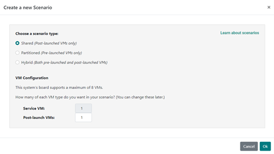
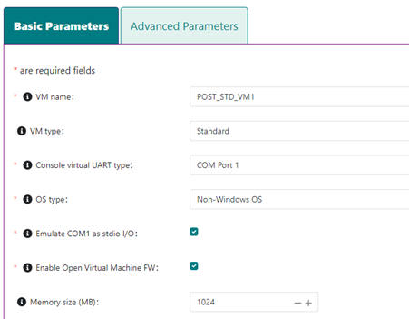
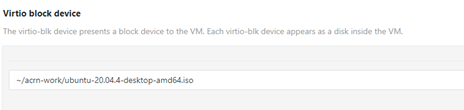

.. _user_vm_guide:

User VM Guide
#############

The ACRN hypervisor uses a Linux-based Service VM and can run User VMs
simultaneously, providing a powerful software platform to build complex
computing systems. A User VM can run a variety of OSs including Linux or
Windows, or an RTOS such as Zephyr or VxWorks. As shown in the :ref:`gsg`,
you use the ACRN Configurator to define options used to build the static
configuration of your ACRN system based on your system design, available
capabilities of your target hardware, and performance characteristics such as
those required for real-time needs. The Configurator also lets you define
dynamic settings for launching User VMs and specifying the resources they need
access to.

ACRN provides a framework called the :ref:`ACRN Device Model
<dm_architecture_intro>`, for sharing physical system resources and providing
virtual device emulation with rich I/O mediators.  The Device Model also
supports non-emulated device passthrough access to satisfy time-sensitive
requirements and low-latency access needs of real-time applications.

In this and accompanying documents, we provide guidance for configuring and
deploying post-launched User VMs, and additional information about OS-specific
settings based on your User VM OS choice. We also show how to configure the
system for accessing virtual devices emulated by the ACRN Device Model or
passthrough resources dedicated to a specific VM.

ACRN also supports pre-launched User VMs, with dedicated resources that are not
shared with other VMs. Pre-launched VMs are configured statically using the
Configurator, with their own boot devices, CPU, memory, and other system
resources.  We'll discuss pre-launched VMs separately.

User VM OS Choices
******************

ACRN has no restrictions on what OS is used by a User VM. The ACRN team has
tested Standard User VMs running Ubuntu 20.04 and Windows 10, and real-time User
VMs running Zephyr, VxWorks, Xenomai, and Linux VMs running on a
PREEMPT_RT-patched kernel.

The ACRN Service VM and its Device Model run on Ubuntu 20.04 using a patched
kernel built from the `acrn-kernel GitHub repository
<https://github.com/projectacrn/acrn-kernel>`_. The Service VM can access
hardware resources directly by running native drivers and provides device
sharing services to post-launched User VMs. The Service VM is not dependent on
any settings in your User VM configuration and is used for both Standard and
Real-time post-launched User VMs.  The Service VM is not used by pre-launched
User VMs.

Configuration Overview
**********************

In the following sections, we provide general guidance and then link to
OS-specific guidance documents based on your choice of User VM OS. 

Separately, and out of scope for this document, you'll need to create a combined
application and User VM OS image for each User VM. 

The ACRN Device Model within the Service VM starts your User VM image using a
launch script created by the ACRN Configurator, based on the settings you
provided. These settings include the location on the target system storage
device for that image, User VM memory size, console, vUART settings for
communication, virtual I/O devices your application uses, and more. Available
launch script options are documented in the :ref:`acrn-dm_parameters` and the
:ref:`scenario-config-options` documentation.  We'll also provide examples for
selected capabilities in our OS-specific guidance.

This guide assumes you've already followed the Getting Started Guide and have
followed steps to prepare the development computer and installed development
system prerequisites, prepared the target and generated a board configuration
file, and have installed the ACRN Configurator.

Using the ACRN Configurator
===========================

Independent of your User VM OS choice, run the ACRN Configurator and create a
scenario with a Post-launched VM for each User VM you will be running. We use
one Ubuntu-based User VM in this overview:

   Creating a new scenario in the Configurator

Use the Configurator to give the VM a name, and define configuration options
specific for this VM, such as memory and VM type (Standard or Real-time):

   Set VM basic configuration options

And define where the User VM image will be on the target system (in this
example, an Ubuntu 20.04 desktop ISO image):

   Set VM image using virtio block device

After the configuration settings are to your liking, save the configuration.
When saving, the ACRN Configurator first validates your scenario configuration and
reports any issues that need your attention.  If successful, it writes out the
updated scenario XML file and launch script to your working directory.  You'll
use this launch script to start the User VM on the target.

Rebuild the ACRN Hypervisor
===========================

After exiting the ACRN Configurator,  build the ACRN hypervisor (based on the static
configuration parameters in your scenario) on your development computer, as was
done in the :ref:`gsg`::

   cd ~/acrn-work/acrn-hypervisor
   make clean && make BOARD=~/acrn-work/MyConfiguration/my_board.board.xml SCENARIO=~/acrn-work/MyConfiguration/scenario.xml

The build typically takes a few minutes. When done, the build generates a Debian
package in the ``./build`` directory.

This Debian package contains the ACRN hypervisor and tools to ease installing ACRN on the target.

Transfer Files to the Target, Install, and Reboot
=================================================

We'll need to get the Debian package containing the hypervisor files we built to
the target system, along with the launch scripts and User VM images. In the
:ref:`gsg`, we used a USB stick, but you could also use the network to copy
files using ``scp``.  Install the Debian package and reboot to run ACRN and the
Service VM.  Then use the launch script to start each User VM.

User VM Persistence
*******************

In the :ref:`gsg` (and in the previous overview), we used a standard Ubuntu
20.04 ISO image as our User VM image. By its nature, an ISO image is read-only.
This means that when you reboot the ACRN system, any changes you made to the
User VM such as installing a new package, would be lost; the unmodified ISO
image is used again for the User VM when the system is rebooted.  While this
could be the usage model you'd like, an alternative is to set up the User VM
image as read-write so it will retain any changes made while it was running and
return to that state after a reboot.

One way to create a persistent VM image is by using KVM to define virtual disk
partitions, boot the underlying OS, add additional packages and even an
application to that image, and then save and convert that QCOW2 image to a raw
format we can use with ACRN.

In separate companion documentation, we provide detail guides for running
User VMs with different OSs, and provide considerations for each of those
standard and real-time OS configurations.

Standard VM OS Considerations
*****************************

Here is a list of Standard User VM OS guides with details and topics to consider
when using one of these OSs:

* :ref:`using_ubuntu_as_user_vm`
* :ref:`using_windows_as_user_vm`
* :ref:`using_celadon_as_user_vm`

Real-time VM OS Considerations
******************************

Here is a list of real-time User VM OS guides with details and topics to consider
when using one of these OSs:

* :ref:`using_xenomai_as_user_vm`
* :ref:`using_vxworks_as_user_vm`
* :ref:`using_zephyr_as_user_vm`

We also recommend reading these RTVM performance guides:

* :ref:`rtvm_workload_guideline`
* :ref:`rt_perf_tips_rtvm`
* :ref:`rt_performance_tuning`
