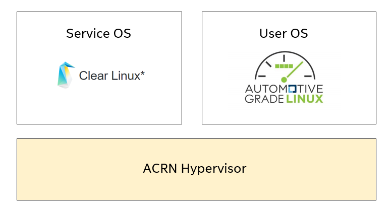
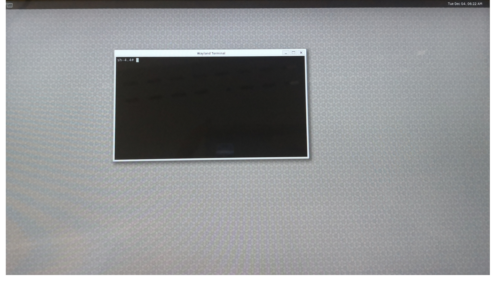

.. _using_agl_as_uos:

Using AGL as the User OS
########################

This tutorial describes the steps to run Automotive Grade Linux (AGL) 
as the User OS on ACRN hypervisor and the problems we got at current stage. 
We hope the steps documented in this article could help us to reproduce the 
problem much easier and provide some information for further debugging.
The regulatory model of APL NUC we used is `NUC6CAYH 
<https://www.intel.com/content/www/us/en/products/boards-kits/nuc/kits/nuc6cayh.html>`_
and other platforms may work too.

Introduction to AGL
*******************

Automotive Grade Linux is a collaborative open source project that is 
bringing together automakers, suppliers and technology companies to 
accelerate the development and adoption of a fully open software stack 
for the connected car. With Linux at its core, AGL is developing an open 
platform from the ground up that can serve as the de facto industry 
standard to enable rapid development of new features and technologies.
For more information about AGL, please visit AGL’s official website:
https://www.automotivelinux.org/.

Steps for using AGL as the UOS
******************************

#. Download the release of AGL from https://download.automotivelinux.org/AGL/release/eel/, 
   and we will use ``eel_5.1.0`` release for example.
    
   .. code-block:: none 
   
      $ cd ~
      $ wget https://download.automotivelinux.org/AGL/release/eel/5.1.0/intel-corei7-64/deploy/images/intel-corei7-64/agl-demo-platform-crosssdk-intel-corei7-64.wic.xz
      $ unxz agl-demo-platform-crosssdk-intel-corei7-64.wic.xz      

#. Download the "kernel-iot-lts2018" kernel:

   .. code-block:: none
  
      $ sudo mkdir ~/uos-kernel-build
      $ cd ~/uos-kernel-build
      $ wget https://download.clearlinux.org/releases/current/clear/x86_64/os/Packages/linux-iot-lts2018-4.19.0-27.x86_64.rpm
      $ rpm2cpio linux-iot-lts2018-4.19.0-27.x86_64.rpm | cpio -idmv
   
   .. note::
      Here we download the kernel from ``current`` Clear Linux version.
      
#. Deploy the UOS kernel modules to UOS virtual disk image 
   (note: you’ll need to use the same iot-lts2018 image version number noted in step 2 above):

   .. code-block:: none

      $ sudo losetup -f -P --show ~/agl-demo-platform-crosssdk-intel-corei7-64.wic
      $ sudo mount /dev/loop0p2 /mnt
      $ sudo cp -r ~/uos-kernel-build/usr/lib/modules/4.19.0-27.iot-lts2018/ /mnt/lib/modules/
      $ sudo umount /mnt
      $ sync

#. You need to adjust the ``/usr/share/acrn/samples/nuc/launch_uos.sh`` script to match your installation.
   These are the couple of lines you need to modify:
    
   .. code-block:: none 
   
      -s 3,virtio-blk,/root/agl-demo-platform-crosssdk-intel-corei7-64.wic \
      -k /usr/lib/kernel/default-iot-lts2018 \
      -B "root=/dev/vda2 ...
     
   .. note::
      In case you have downloaded a different AGL image or store the image in other directory, 
      you will need to modify the AGL file name or directory (the ``-s 3,virtio-blk`` argument) 
      to match what you have downloaded above. 
      Likewise, you may need to adjust the kernel file name to ``default-iot-lts2018``.
      
#. Start the User OS (UOS):
    
   .. code-block:: none   

      $ sudo /usr/share/acrn/samples/nuc/launch_uos.sh
       
   **Congratulations**, you are now watching the User OS booting up!

   And you should be able to see the console of AGL:

   .. image:: images/The-console-of-AGL.png
      :align: center
      
   When you see the output of the console above, that means AGL has been loaded 
   and now you could operate on the console. 

Enable the display of AGL
*************************

But following the setup steps before, you will get black screen in AGL. 
Please don't worry about it, and we will give the solutions to the black screen issue in AGL.
By debugging, we identified the problem as an issue of ``ivi-shell.so`` library, it seems that 
this library is not well supported. But we can light the screen with the GUI of weston like figure below.

   
To enable weston in AGL, We need to modify ``weston.ini``, which is the configuration file of weston.

.. code-block:: none
   
   $ vim /etc/xdg/weston/weston.ini
   
The changes of ``weston.ini``:

#. Comment ``ivi-shell.so`` out

#. Check the name of output is ``HDMI-A-2``

After that, there are still some steps need to do to launch weston in AGL:

.. code-block:: none

   $ export XDG_RUNTIME_DIR=/run/platform/display
   $ systemctl restart weston

And you will be able to see the GUI of weston in AGL now.

Follow up
*********
ACRN Hypervisor is trying to support more kinds of operating systems all the time, 
and AGL is an example of them. We are still debugging the “ivi-shell.so” issue, 
and we are also investigating the problem why AGL GUI not got launched, 
currently it may either be a configuration issue or a real bug, more experiment will be done.
