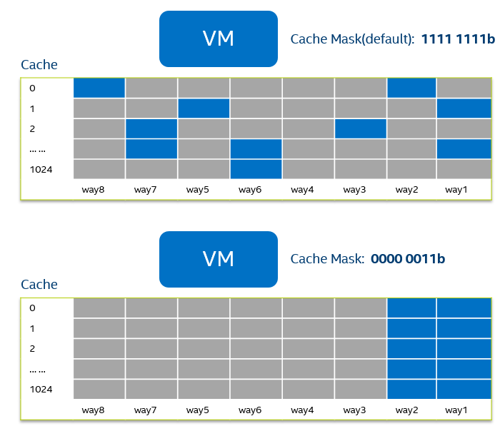
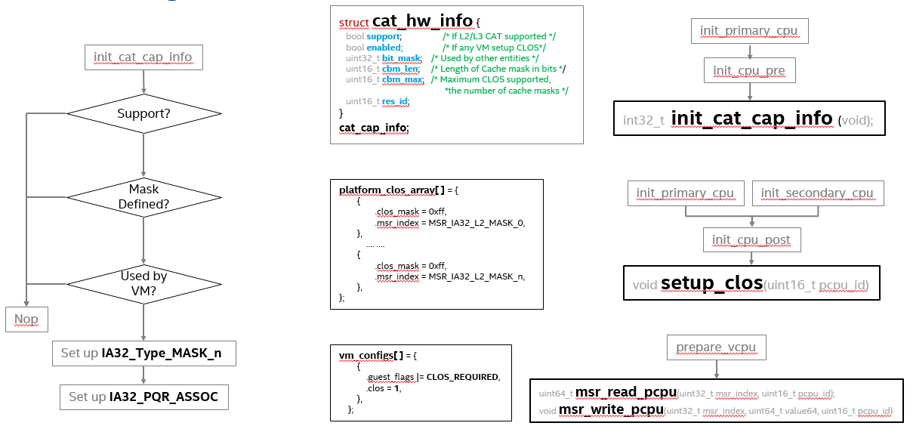

.. _using_cat_up2:

Using CAT on UP2
################

The UP Squared board `(UP2) <https://up-board.org/upsquared/specifications/>`_
is an x86 maker board based on the Intel Apollo Lake platform and supports
Cache Allocation Technology (CAT). With this feature, the usage of cache can be
restricted to each VM. ACRN hypervisor can do that by giving each VM a cache mask,
so that the VM will not evict the masked cache lines, as shown in :numref:
`cache-mask-vm`:

   Cache usage with Cache Mask

CAT Support on ACRN
*******************

As described at `Intel (R) 64 and IA-32 Architectures Software Developer's Manual
<https://software.intel.com/en-us/download/intel-64-and-ia-32-architectures-sdm-combined-volumes-3a-3b-3c-and-3d-system-programming-guide>`_,
chapter 17.19, volume 3. There are 3 steps to use CAT:

1. Detect the CAT capability.
2. Setup cache mask array MSRs, which is referred to as Class of Service (CLOS) array.
3. Select one of the CLOS array for the CPU, that will be the cache mask of the CPU.

ACRN integrates the usage of CAT into VM configuration. The CLOS array must be defined
in the board config source code, and the VM needs to specify which CLOS to use in its VM
config data. If the platform supports CAT, the CLOS array will be written to the CLOS MSRs
at CPU init time, and the VM will set CLOS for VCPU at VM launch time.
The details are shown in :numref:`acrn-cat-hld`:

   CAT Support on ACRN

Tuning CAT in HV debug shell
############################

From the ACRN HV debug shell, you can use ``cpuid``, ``wrmsr/rdmsr`` debug commands to
enumerate CAT capability and tune CAT parameters. You can use the UP2 board's serial port
for the HV shell (refer to :ref:`getting-started-up2` for setup instructions).

#. Check CAT ability with ``cupid``. First run ``cpuid 0x10 0x0``, the return value ebx[bit 2]
   reports the L2 CAT is supported. Then run ``cpuid 0x10 0x2`` to query L2 CAT capability,
   the return value eax[bit 4:0] reports the cache mask has 8 bit, and edx[bit 15:0] reports 4 CLOS are
   supported, as shown below:

   .. code-block:: none

      ACRN:\>cpuid 0x10 0x0
      cpuid leaf: 0x10, subleaf: 0x0, 0x0:0x4:0x0:0x0

      ACRN:\>cpuid 0x10 0x2
      cpuid leaf: 0x10, subleaf: 0x2, 0x7:0x0:0x0:0x3

#. Check PCPU IDs of each VM, the ``vcpu_list`` shows that VM0 is running on PCPU0,
   and VM1 is running on PCPU1:

   .. code-block:: none

      ACRN:\>vcpu_list

      VM ID    PCPU ID    VCPU ID    VCPU ROLE    VCPU STATE
      =====    =======    =======    =========    ==========
        0         0          0        PRIMARY       Running
        1         1          0        PRIMARY       Running

#. Set CLOS with ``wrmsr <reg_num> <value>``, we want VM1 to use the lower 6 ways of cache,
   so CLOS0 is set to 0xc0 for the upper 2 ways, and CLOS1 is set to 0x3f for the lower
   6 ways:

   .. code-block:: none

      ACRN:\>wrmsr  -p1 0xd10  0xc0
      ACRN:\>wrmsr  -p1 0xd11  0x3f

#. Attach COS1 to PCPU1. Because MSR IA32_PQR_ASSOC [bit 63:32], we'll write 0x100000000
   to it to use CLOS1

   .. code-block:: none

      ACRN:\>wrmsr   -p1   0xc8f    0x100000000

.. _configure_cat_vm:

Configure CAT for VM with VM Configuration
##########################################

#. CAT on ACRN can be enabled and configured by modifying source code, so the first
   step is to clone the ACRN source code (if you haven't already):

   .. code-block:: none

      $ git clone https://github.com/projectacrn/acrn-hypervisor.git
      $ cd acrn-hypervisor/

#. The predefined cache masks can be found at
   ``hypervisor/arch/x86/configs/$(CONFIG_BOARD)/board.c``, for UP2 board, that is
   ``hypervisor/arch/x86/configs/apl-up2/board.c``, you can change the mask values,
   but note that the CLOS mask must have continuous bits, or a #GP fault can be triggered.

   .. code-block:: none
      :emphasize-lines: 3,7,11,15

      struct platform_clos_info platform_clos_array[4] = {
              {
                      .clos_mask = 0xff,
                      .msr_index = MSR_IA32_L2_MASK_0,
              },
              {
                      .clos_mask = 0xff,
                      .msr_index = MSR_IA32_L2_MASK_1,
              },
              {
                      .clos_mask = 0xff,
                      .msr_index = MSR_IA32_L2_MASK_2,
              },
              {
                      .clos_mask = 0xff,
                      .msr_index = MSR_IA32_L2_MASK_3,
              },
      };

#. Set up CLOS in the VM config. If you want a VM to use one of the CLOSs, you need to find its
   configuration data and modify it. We will take SOS on sharing mode as an example. Its
   configuration data can be found at ``hypervisor/arch/x86/configs/vm_config.c``

   .. code-block:: none
      :emphasize-lines: 5,6

      struct acrn_vm_config vm_configs[CONFIG_MAX_VM_NUM] __aligned(PAGE_SIZE) = {
              {
                      .type = SOS_VM,
                      .name = SOS_VM_CONFIG_NAME,
                      .guest_flags = SOS_VM_CONFIG_GUEST_FLAGS | CLOS_REQUIRED,
                      .clos = 1,
                      .memory = {
                              .start_hpa = 0x0UL,
                              .size = CONFIG_SOS_RAM_SIZE,
                      },
                      .os_config = {
                              .name = SOS_VM_CONFIG_OS_NAME,
                      },
              },
      };

#. Build the ACRN hypervisor and copy the artifact ``acrn.efi`` to the
   ``/boot/EFI/acrn`` directory, see :ref:`getting-started-building` for building instructions.

   .. code-block:: none

      $ make hypervisor BOARD=apl-up2 FIRMWARE=uefi
      ...

      # these operations are done on UP2 board
      $ mount /dev/mmcblk0p0 /boot
      $ scp <acrn.efi-at-your-compile-PC> /boot/EFI/acrn

#. Restart the UP2 board
