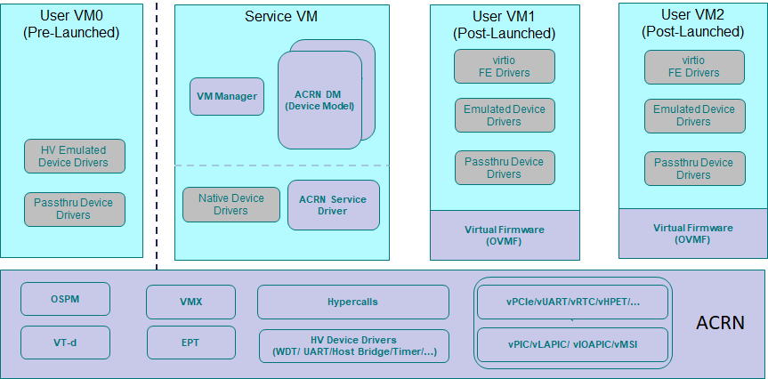

.. _using_hybrid_mode_on_nuc:

Getting Started Guide for ACRN hybrid mode
##########################################
ACRN hypervisor supports a hybrid scenario where the User VM (such as Zephyr
or Ubuntu) runs in a pre-launched VM or in a post-launched VM that is
launched by a Device model in the Service VM. The following guidelines
describe how to set up the ACRN hypervisor hybrid scenario on the Intel NUC,
as shown in :numref:`hybrid_scenario_on_nuc`.

   The Hybrid scenario on the Intel NUC

Prerequisites
*************
- Use the `Intel NUC Kit NUC7i7DNHE <https://www.intel.com/content/www/us/en/products/boards-kits/nuc/kits/nuc7i7dnhe.html>`_.
- Connect to the serial port as described in :ref:`Connecting to the serial port <connect_serial_port>`.
- Install Ubuntu 18.04 on your SATA device or on the NVME disk of your NUC.

Update Ubuntu GRUB
******************

Perform the following to update Ubuntu GRUB so it can boot the hypervisor and load the kernel image:

#. Append the following configuration in the ``/etc/grub.d/40_custom`` file:

   .. code-block:: bash
      :emphasize-lines: 10,11

      menuentry 'ACRN hypervisor Hybrid Scenario' --id ACRN_Hybrid --class ubuntu --class gnu-linux --class gnu --class os $menuentry_id_option 'gnulinux-simple-e23c76ae-b06d-4a6e-ad42-46b8eedfd7d3' {
         recordfail
         load_video
         gfxmode $linux_gfx_mode
         insmod gzio
         insmod part_gpt
         insmod ext2
         echo 'Loading hypervisor Hybrid scenario ...'
         multiboot2 /boot/acrn.bin
         module2 /boot/zephyr.bin xxxxxx
         module2 /boot/bzImage yyyyyy

      }

   .. note:: The module ``/boot/zephyr.bin`` is the VM0 (Zephyr) kernel file.
      The param ``xxxxxx`` is VM0's kernel file tag and must exactly match the
      ``kernel_mod_tag`` of VM0 which is configured in the ``misc/vm_configs/scenarios/hybrid/vm_configurations.c``
      file. The multiboot module ``/boot/bzImage`` is the Service VM kernel
      file. The param ``yyyyyy`` is the bzImage tag and must exactly match the
      ``kernel_mod_tag`` of VM1 in the ``misc/vm_configs/scenarios/hybrid/vm_configurations.c``
      file. The kernel command line arguments used to boot the Service VM are
      located in the header file ``misc/vm_configs/scenarios/hybrid/vm_configurations.h``
      and are configured by the `SOS_VM_BOOTARGS` macro.

#. Modify the ``/etc/default/grub`` file as follows to make the GRUB menu
   visible when booting:

   .. code-block:: bash

      GRUB_DEFAULT=ACRN_Hybrid
      GRUB_TIMEOUT=5
      # GRUB_HIDDEN_TIMEOUT=0
      GRUB_HIDDEN_TIMEOUT_QUIET=false

#. Update GRUB::

   $ sudo update-grub

#. Reboot the NUC. Select the **ACRN hypervisor Hybrid Scenario** entry to boot
   the ACRN hypervisor on the NUC's display. The GRUB loader will boot the
   hypervisor, and the hypervisor will start the VMs automatically.

Hybrid Scenario Startup Checking
********************************
#. Use these steps to verify that the hypervisor is properly running:

   a. Log in to the ACRN hypervisor shell from the serial console.
   #. Use the vm_list command to verify that the pre-launched VM and Service VM are launched successfully.

#. Use these steps to verify all VMs are running properly:

   a. Use the ``vm_console 0`` to switch to VM0 (Zephyr) console. It will display **Hello world! acrn**.
   #. Enter :kbd:`Ctrl` + :kbd:`Space` to return to the ACRN hypervisor shell.
   #. Use the ``vm_console 1`` command to switch to the VM1 (Service VM) console.
   #. Verify that the VM1's Service VM can boot up and you can log in.
   #. ssh to VM1 and launch the post-launched VM2 using the ACRN device model launch script.
   #. Go to the Service VM console, and enter :kbd:`Ctrl` + :kbd:`Space` to return to the ACRN hypervisor shell.
   #. Use the ``vm_console 2`` command to switch to the VM2 (User VM) console.
   #. Verify that VM2 can boot up and you can log in.

Refer to the :ref:`acrnshell` for more information about available commands.
