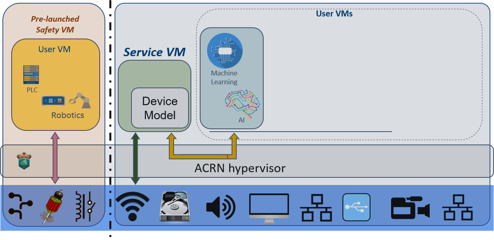

.. _using_hybrid_mode_on_nuc:

Getting Started Guide for ACRN Hybrid Mode
##########################################

ACRN hypervisor supports a hybrid scenario where the User VM (such as Zephyr
or Ubuntu) runs in a pre-launched VM or in a post-launched VM that is
launched by a Device model in the Service VM.

   The Hybrid scenario on the Intel NUC

The following guidelines
describe how to set up the ACRN hypervisor hybrid scenario on the Intel NUC,
as shown in :numref:`hybrid_scenario_on_nuc`.

.. note::

   All build operations are done directly on the target. Building the artifacts (ACRN hypervisor, kernel, tools and Zephyr)
   on a separate development machine can be done but is not described in this document.

.. contents::
   :local:
   :depth: 1

.. rst-class:: numbered-step

Set-up base installation
************************

- Use the `Intel NUC Kit NUC7i7DNHE <https://www.intel.com/content/www/us/en/products/boards-kits/nuc/kits/nuc7i7dnhe.html>`_.
- Connect to the serial port as described in :ref:`Connecting to the serial port <connect_serial_port>`.
- Install Ubuntu 18.04 on your SATA device or on the NVME disk of your
  Intel NUC.

.. rst-class:: numbered-step

Prepare the Zephyr image
************************

Prepare the Zephyr kernel that you will run in VM0 later.

- Follow step 1 from the :ref:`using_zephyr_as_uos` instructions

  .. note:: We only need the ELF binary Zephyr kernel, not the entire ``zephyr.img``

- Copy the :file:`zephyr/zephyr.elf` to the ``/boot`` folder::

   sudo cp zephyr/zephyr.elf /boot

.. rst-class:: numbered-step

Set-up ACRN on your device
**************************

- Follow the instructions in :Ref:`gsg` to build ACRN using the
  ``hybrid`` scenario. Here is the build command-line for the `Intel NUC Kit NUC7i7DNHE <https://www.intel.com/content/www/us/en/products/boards-kits/nuc/kits/nuc7i7dnhe.html>`_::

     make BOARD=nuc7i7dnb SCENARIO=hybrid

- Install the ACRN hypervisor and tools

  .. code-block:: none

     cd ~/acrn-hypervisor # Or wherever your sources are
     sudo make install
     sudo cp build/hypervisor/acrn.bin /boot
     sudo cp build/hypervisor/acpi/ACPI_VM0.bin /boot

- Build and install the ACRN kernel

  .. code-block:: none

     cd ~/acrn-kernel # Or where your ACRN kernel sources are
     cp kernel_config_uefi_sos .config
     make olddefconfig
     make
     sudo make modules_install
     sudo cp arch/x86/boot/bzImage /boot/bzImage

.. rst-class:: numbered-step

Update Ubuntu GRUB
******************

Perform the following to update Ubuntu GRUB so it can boot the hypervisor and load the kernel image:

#. Append the following configuration in the ``/etc/grub.d/40_custom`` file:

   .. code-block:: bash
      :emphasize-lines: 10,11,12

      menuentry 'ACRN hypervisor Hybrid Scenario' --id ACRN_Hybrid --class ubuntu --class gnu-linux --class gnu --class os $menuentry_id_option 'gnulinux-simple-e23c76ae-b06d-4a6e-ad42-46b8eedfd7d3' {
         recordfail
         load_video
         gfxmode $linux_gfx_mode
         insmod gzio
         insmod part_gpt
         insmod ext2
         echo 'Loading hypervisor Hybrid scenario ...'
         multiboot2 /boot/acrn.bin
         module2 /boot/zephyr.elf xxxxxx
         module2 /boot/bzImage yyyyyy
         module2 /boot/ACPI_VM0.bin ACPI_VM0

      }

     
   .. note:: The module ``/boot/zephyr.elf`` is the VM0 (Zephyr) kernel file.
      The param ``xxxxxx`` is VM0's kernel file tag and must exactly match the
      ``kern_mod`` of VM0, which is configured in the ``misc/config_tools/data/nuc7i7dnb/hybrid.xml``
      file. The multiboot module ``/boot/bzImage`` is the Service VM kernel
      file. The param ``yyyyyy`` is the bzImage tag and must exactly match the
      ``kern_mod`` of VM1 in the ``misc/config_tools/data/nuc7i7dnb/hybrid.xml``
      file. The kernel command-line arguments used to boot the Service VM are
      ``bootargs`` of VM1 in the ``misc/config_tools/data/nuc7i7dnb/hybrid.xml``.
      The module ``/boot/ACPI_VM0.bin`` is the binary of ACPI tables for pre-launched VM0 (Zephyr).
      The parameter ``ACPI_VM0`` is VM0's ACPI tag and should not be modified.

#. Correct example Grub configuration (with ``module2`` image paths set):

   .. code-block:: console
      :emphasize-lines: 10,11,12

      menuentry 'ACRN hypervisor Hybrid Scenario' --id ACRN_Hybrid --class ubuntu --class gnu-linux --class gnu --class os $menuentry_id_option 'gnulinux-simple-e23c76ae-b06d-4a6e-ad42-46b8eedfd7d3' {
         recordfail
         load_video
         gfxmode $linux_gfx_mode
         insmod gzio
         insmod part_gpt
         insmod ext2
         echo 'Loading hypervisor Hybrid scenario ...'
         multiboot2 /boot/acrn.bin
         module2 /boot/zephyr.elf Zephyr_ElfImage
         module2 /boot/bzImage Linux_bzImage
         module2 /boot/ACPI_VM0.bin ACPI_VM0
         
      }

#. Modify the ``/etc/default/grub`` file as follows to make the GRUB menu
   visible when booting:

   .. code-block:: bash

      GRUB_DEFAULT=ACRN_Hybrid
      GRUB_TIMEOUT=5
      # GRUB_HIDDEN_TIMEOUT=0
      GRUB_HIDDEN_TIMEOUT_QUIET=false

#. Update GRUB::

   $ sudo update-grub

#. Reboot the Intel NUC. Select the **ACRN hypervisor Hybrid Scenario** entry to boot
   the ACRN hypervisor on the Intel NUC's display. The GRUB loader will boot the
   hypervisor, and the hypervisor will start the VMs automatically.

.. rst-class:: numbered-step

Hybrid Scenario Startup Check
*****************************
#. Refer to the **Test the Communication Port** section in the
   :ref:`connect_serial_port` tutorial.

#. Use these steps to verify that the hypervisor is properly running:

   a. Log in to the ACRN hypervisor shell from the serial console.
   #. Use the vm_list command to verify that the pre-launched VM and Service VM are launched successfully.

#. Use these steps to verify all VMs are running properly:

   a. Use the ``vm_console 0`` to switch to VM0 (Zephyr) console. It will display ``Hello world! acrn``.
   #. Enter :kbd:`Ctrl` + :kbd:`Space` to return to the ACRN hypervisor shell.
   #. Use the ``vm_console 1`` command to switch to the VM1 (Service VM) console.
   #. Verify that the VM1's Service VM can boot and you can log in.
   #. ssh to VM1 and launch the post-launched VM2 using the ACRN device model launch script.
   #. Go to the Service VM console, and enter :kbd:`Ctrl` + :kbd:`Space` to return to the ACRN hypervisor shell.
   #. Use the ``vm_console 2`` command to switch to the VM2 (User VM) console.
   #. Verify that VM2 can boot and you can log in.

Refer to the :ref:`acrnshell` for more information about available commands.
