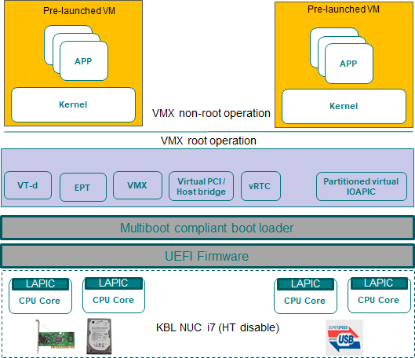

.. _using_partition_mode_on_nuc:

Using partition mode on NUC
###########################

ACRN hypervisor supports logical partition scenario, in which the User OS (such
as Clear Linux) running in a pre-launched VM can bypass the ACRN hypervisor and
directly access isolated PCI devices. The following guidelines provide step by
step instructions on how to set up the ACRN hypervisor logical partition
scenario on Intel NUC running two pre-launched VMs. The logical partition
scenario on Intel NUC is shown in
:numref:`logical_partition_scenario_on_nuc`.

   The logical partition scenario on Intel NUC

Prerequisites
*************

* `Intel NUC Kit NUC7i7DNHE <https://www.intel.com/content/www/us/en/products/boards-kits/nuc/kits/nuc7i7dnhe.html>`_
* Connecting to the serial port, described in :ref:`getting-started-apl-nuc`
* NVMe disk
* SATA disk
* Storage device with USB interface (such as USB Flash
  or SATA disk connected with a USB3.0 SATA converter etc)
* Disable "Intel Hyper Threading Technology" in the BIOS, to avoid
  interference from logical cores for the logical partition scenario.
* In the logical partition scenario, two VMs (running Clear Linux)
  are started by the ACRN hypervisor.  Each VM has its own root
  filesystem. Set up each VM by following the `Install Clear Linux
  OS on bare metal with live server
  <https://clearlinux.org/documentation/clear-linux/get-started/bare-metal-install-server>`_
  and install Clear Linux OS first on a SATA disk and then again
  on a storage device with a USB interface. The two pre-launched
  VMs will mount the root file systems via the SATA controller and
  the USB controller respectively.

Update kernel image and modules of Pre-launched VM
**************************************************
#. On your development workstation, clone the ACRN kernel source tree, and build
   the Linux kernel image that will be used to boot the pre-launched VMs:

   .. code-block:: none

      $ git clone https://github.com/projectacrn/acrn-kernel.git
      Cloning into 'acrn-kernel'...
      ...
      $ cd acrn-kernel
      $ cp kernel_config_uos .config
      $ make olddefconfig
      scripts/kconfig/conf  --olddefconfig Kconfig
      #
      # configuration written to .config
      #
      $ make
      $ make modules_install INSTALL_MOD_PATH=out/

   The last two commands build the bootable kernel image as
   ``arch/x86/boot/bzImage``, and loadable kernel modules under the ``./out/``
   folder. Copy these files to a removable disk for installing on the NUC later.

#. Current ACRN logical partition scenario implementation requires a multi-boot
   capable bootloader to boot both the ACRN hypervisor and the bootable kernel
   image built from the previous step. Install Ubuntu OS to the on-board NVMe
   SSD by following the `Ubuntu desktop installation instructions
   <https://tutorials.ubuntu.com/tutorial/tutorial-install-ubuntu-desktop>`_ The
   Ubuntu installer creates 3 disk partitions on the on-board NVMe SSD. By
   default, the GRUB bootloader is installed on the EFI System Partition (ESP),
   used to bootstrap the ACRN hypervisor.
#. After installing the Ubuntu OS, power off the NUC, attach the
   SATA disk and storage device with USB interface to the NUC. Power on the
   NUC and make sure it boots the Ubuntu OS from the NVMe SSD. Plug in the
   removable disk with kernel image into the NUC, then copy the loadable
   kernel modules built in Step 1 to the ``/lib/modules/`` folder on both the
   mounted SATA disk and storage device with USB interface. For example,
   assuming the SATA disk and storage device with USB interface are assigned to
   ``/dev/sda`` and ``/dev/sdb`` respectively, the following commands set up the
   partition mode loadable kernel modules onto the root file systems to be
   loaded by the pre-launched VMs:

   .. code-block:: none

      # Mount the Clear Linux OS root filesystem on the SATA disk
      $ sudo mount /dev/sda3 /mnt
      $ sudo cp -r <kernel-modules-folder-built-in-step1>/lib/modules/* /mnt/lib/modules
      $ sudo umount /mnt
      # Mount the Clear Linux OS root filesystem on the USB flash disk
      $ sudo mount /dev/sdb3 /mnt
      $ sudo cp -r <path-to-kernel-module-folder-built-in-step1>/lib/modules/* /mnt/lib/modules
      $ sudo umount /mnt

#. Copy the bootable kernel image to the /boot directory:

   .. code-block:: none

      $ sudo cp <path-to-kernel-image-built-in-step1>/bzImage /boot/

Update ACRN hypervisor Image
****************************

#. Before building the ACRN hypervisor, you need to figure out the I/O
   address of the serial port, and the PCI BDF addresses of the SATA controller
   and the USB controllers on the NUC. Enter the following command to get the
   I/O addresses of the serial port. The NUC supports one serial port ttyS0.
   You'll need to connect the serial port to the development workstation, in
   order to access the ACRN serial console to switch between pre-launched VMs:

   .. code-block:: none

      $ dmesg | grep ttyS0
      [    0.000000] console [ttyS0] enabled
      [    1.562546] 00:01: ttyS0 at I/O 0x3f8 (irq = 4, base_baud = 115200) is
      a 16550A

   The following command prints detailed information about all PCI buses and
   devices in the system:

   .. code-block:: none

      $ sudo lspci -vv
      00:14.0 USB controller: Intel Corporation Sunrise Point-LP USB 3.0 xHCI Controller (rev 21) (prog-if 30 [XHCI])
              Subsystem: Intel Corporation Sunrise Point-LP USB 3.0 xHCI Controller
      00:17.0 SATA controller: Intel Corporation Sunrise Point-LP SATA Controller [AHCI mode] (rev 21) (prog-if 01 [AHCI 1.0])
              Subsystem: Intel Corporation Sunrise Point-LP SATA Controller [AHCI mode]
      00:1f.6 Ethernet controller: Intel Corporation Ethernet Connection I219-LM (rev 21)
              Subsystem: Intel Corporation Ethernet Connection I219-LM

   .. note::

      Double check PCI devices BDF defined in the
      ``hypervisor/arch/x86/configs/nuc7i7bnh/pci_devices.h``
      with the information reported by the ``lspci -vv`` command.

#. Clone the ACRN source code and configure the build options

   Please refer :ref:`getting-started-building` to setup ACRN build environment
   on your development workstation.

   Clone the ACRN source code:

   .. code-block:: none

      $ git clone https://github.com/projectacrn/acrn-hypervisor.git
      $ cd acrn-hypervisor/hypervisor

   Configure the build options:

   .. code-block:: none

      $ make defconfig BOARD=nuc7i7bnh
      $ make menuconfig

   Updates the following configure item:

   * Set ACRN Scenario as "Logical Partition VMs";
   * Set Maximum number of VCPUs per VM as "2";
   * Set Maximum number of PCPU as "4";
   * Clear/Disable “Enable hypervisor relocation”.

   We recommend keeping the default values of items not mentioned above.

#. Check Ubuntu boot loader name

   On the current design, logical partition depends on the GRUB boot loader,
   otherwise, the hypervisor will fail to boot. Double check the default boot
   loader is GRUB:

   .. code-block:: none

      $ sudo update-grub -V

   The above command output should contain the ``GRUB`` keyword.

#. Check or update BDF information of PCI devices of each pre-launched VM;
   Check it in the ``hypervisor/arch/x86/configs/nuc7i7bnh/pci_devices.h``.

#. Build the ACRN hypervisor and copy the artifact ``acrn.32.out`` to the
   ``/boot`` directory:

   #. Build ACRN hypervisor:

      .. code-block:: none

         $ make

   #. Copy ``acrn.32.out`` to a removable disk.

   #. Plug in the removable disk into the NUC's USB port.

   #. Copy the ``acrn.32.out`` from removable disk to ``/boot`` directory.

Update Ubuntu GRUB to Boot hypervisor and Load Kernel Image
***********************************************************

#. Append the following configuration to the ``/etc/grub.d/40_custom`` file:

   .. code-block:: none

      menuentry 'ACRN hypervisor Logical Partition Scenario' --class ubuntu --class gnu-linux --class gnu --class os $menuentry_id_option 'gnulinux-simple-e23c76ae-b06d-4a6e-ad42-46b8eedfd7d3' {
              recordfail
              load_video
              gfxmode $linux_gfx_mode
              insmod gzio
              insmod part_gpt
              insmod ext2

              echo 'Loading hypervisor logical partition scenario ...'
              multiboot --quirk-modules-after-kernel /boot/acrn.32.out
              module /boot/bzImage
      }

   .. note::

      The kernel command line arguments used to boot the pre-launched VMs is
      located in header file
      ``hypervisor/scenarios/logical_partition/vm_configurations.h`` and
      configured by ``VMx_CONFIG_OS_BOOTARG_*`` MACROs (where x is the VM id
      number and ``*`` are arguments).

#. Modify the ``/etc/default/grub`` file as follows to make the GRUB menu
   visible when booting:

   .. code-block:: none

      #GRUB_HIDDEN_TIMEOUT=0
      GRUB_HIDDEN_TIMEOUT_QUIET=false

#. Update grub:

   .. code-block:: none

      $ sudo update-grub

#. Reboot the NUC. Select the "ACRN hypervisor Logical Partition
   Scenario" entry to boot the logical partition of the ACRN hypervisor on the
   NUC's display. The GRUB loader will boot the hypervisor, and the
   hypervisor will start two pre-launched VMs automatically.

Logical Partition Scenario Startup Checking
*******************************************

#. Use these steps to verify the hypervisor is properly running:

   #. Login ACRN hypervisor shell from serial console.
   #. Use the ``vm_list`` check pre-launched VMs.
#. Use these steps to verify the two pre-launched VMs are running properly:

   #. Use the ``vm_console 0`` to switch to VM0's console.
   #. The VM0's clearlinux OS could boot up and login in.
   #. Use a ``Ctrl-Spacebar`` to return to the Acrn hypervisor shell.
   #. Use the ``vm_console 1`` to switch to VM1's console.
   #. The VM1's clearlinux OS could boot up and login in.

Refer to the :ref:`ACRN hypervisor shell user guide <acrnshell>`
for more information about available commands.
