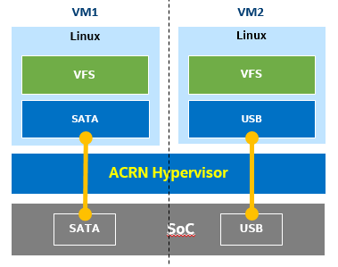

.. _partition_mode:

Using partition mode on UP2
###########################

ACRN hypervisor supports partition mode, in which the User OS running in a
privileged VM can bypass the ACRN hypervisor and directly access isolated
PCI devices. This tutorial provides step by step instructions on how to set up
the ACRN hypervisor partition mode on
`UP2 <https://up-board.org/upsquared/specifications/>`_ boards running two
privileged VMs as shown in :numref:`two-priv-vms`:

   
   Two privileged VMs running in partition mode

Prerequisites
*************

In this tutorial two Linux privileged VMs are started by the ACRN hypervisor.
To set up the Linux root filesystems for each VM, follow the Clear Linux OS
`bare metal installation guide <https://clearlinux.org/documentation/clear-linux/get-started/bare-metal-install#bare-metal-install>`_
to install Clear Linux OS on a **SATA disk** and a **USB flash disk** prior the setup,
as the two privileged VMs will mount the root filesystems via the SATA controller
and the USB controller respectively.

Build kernel and modules for partition mode UOS
***********************************************

#. On your development workstation, clone the ACRN kernel source tree, and
   build the Linux kernel image that will be used to boot the privileged VMs:

   .. code-block:: none

     $ git clone https://github.com/projectacrn/acrn-kernel.git
     Cloning into 'acrn-kernel'...
     ...
     $ cd acrn-kernel
     $ cp kernel_config_uos .config
     
     $ make olddefconfig
     scripts/kconfig/conf  --olddefconfig Kconfig
     #
     # configuration written to .config
     #

     $ make
     $ make modules_install INSTALL_MOD_PATH=out/

   The last two commands built the bootable kernel image ``arch/x86/boot/bzImage``,
   and the loadable kernel modules under the ``./out/`` folder. Copy these files
   to a removable disk for installing on the UP2 board later.

#. Current ACRN partition mode implementation requires a multi-boot capable
   bootloader to boot both ACRN hypervisor and the bootable kernel image
   built from the previous step. You could install Ubuntu OS to the UP2 board
   by following
   `this Ubuntu tutorial <https://tutorials.ubuntu.com/tutorial/tutorial-install-ubuntu-desktop>`_.
   The Ubuntu installer creates 3 disk partitions on the on-board eMMC memory.
   By default, the GRUB bootloader is installed on the ESP (EFI System Partition)
   partition, which will be used to bootstrap the partition mode ACRN hypervisor.

#. After installing the Ubuntu OS, power off the UP2 board, attach the SATA disk
   and the USB flash disk to the board. Power on the board and make sure 
   it boots the Ubuntu OS from the eMMC, then copy the loadable kernel modules
   built in Step 1 to the ``/lib/modules/`` folder on both the mounted SATA
   disk and USB disk. For example, assuming the SATA disk and USB flash disk
   are assigned to ``/dev/sda`` and ``/dev/sdb`` respectively, the following
   commands set up the partition mode loadable kernel modules onto the root
   filesystems to be loaded by the privileged VMs:

   .. code-block:: none

     # Mount the Clear Linux OS root filesystem on the SATA disk
     $ sudo mount /dev/sda3 /mnt
     $ sudo cp -r <kernel-modules-folder-built-in-step1>/lib/modules/* /mnt/lib/modules
     $ sudo umount /mnt
     
     # Mount the Clear Linux OS root filesystem on the USB flash disk
     $ sudo mount /dev/sdb3 /mnt
     $ sudo cp -r <path-to-kernel-module-folder-built-in-step1>/lib/modules/* /mnt/lib/modules
     $ sudo umount /mnt

#. Copy the bootable kernel image to the ``/boot`` directory:

   .. code-block:: none

     $ sudo cp <path-to-kernel-image-built-in-step1>/bzImage /boot/

Enable partition mode in ACRN hypervisor
****************************************

#. Before building the ACRN hypervisor, you need to figure out the I/O address
   of the serial port, and the PCI BDF addresses of the SATA controller and
   the USB controller on your UP2 board.

   Enter the following command to get the I/O addresses of the serial ports.
   UP2 boards support two serial ports. The addresses from the command
   output represent the I/O addresses of the serial port of the 10-pin side
   connector and the 40-pin expansion header respectively. You will need to
   connect the serial port to the development host, in order to access
   the ACRN serial console to switch between privileged VMs.

   .. code-block:: none
     :emphasize-lines: 1

     $ sudo lspci | grep UART
     00:18.0 . Series HSUART Controller #1 (rev 0b)
     00:18.1 . Series HSUART Controller #2 (rev 0b)

   The second with ``00:18.1`` is the one on the 40-pin expansion connector.

   The following command prints detailed information about all PCI buses
   and devices in the system.

   .. code-block:: none
     :emphasize-lines: 1,3,16

     $ sudo lspci -vv
     ...
     00:12.0 SATA controller: Intel Corporation Device 5ae3 (rev 0b) (prog-if 01 [AHCI 1.0])
         Subsystem: Intel Corporation Device 7270
         Control: I/O+ Mem+ BusMaster+ SpecCycle- MemWINV- VGASnoop- ParErr- Stepping- SERR- FastB2B- DisINTx+
         Status: Cap+ 66MHz+ UDF- FastB2B+ ParErr- DEVSEL=medium >TAbort- <TAbort- <MAbort- >SERR- <PERR- INTx-
         Latency: 0
         Interrupt: pin A routed to IRQ 123
         Region 0: Memory at 91514000 (32-bit, non-prefetchable) [size=8K]
         Region 1: Memory at 91537000 (32-bit, non-prefetchable) [size=256]
         Region 2: I/O ports at f090 [size=8]
         Region 3: I/O ports at f080 [size=4]
         Region 4: I/O ports at f060 [size=32]
         Region 5: Memory at 91536000 (32-bit, non-prefetchable) [size=2K]
     ...
     00:15.0 USB controller: Intel Corporation Device 5aa8 (rev 0b) (prog-if 30 [XHCI])
         Subsystem: Intel Corporation Device 7270
         Control: I/O- Mem+ BusMaster+ SpecCycle- MemWINV- VGASnoop- ParErr- Stepping- SERR- FastB2B- DisINTx+
         Status: Cap+ 66MHz- UDF- FastB2B+ ParErr- DEVSEL=medium >TAbort- <TAbort- <MAbort- >SERR- <PERR- INTx-
         Latency: 0
         Interrupt: pin A routed to IRQ 122
         Region 0: Memory at 91500000 (64-bit, non-prefetchable) [size=64K]

#. Clone the ACRN source code and configure the build options with
   ``make menuconfig`` command:

   .. code-block:: none

     $ git clone https://github.com/projectacrn/acrn-hypervisor.git
     $ cd acrn-hypervisor/hypervisor
     $ make menuconfig

   Set the ``Hypervisor mode`` option to ``Partition mode``, and depending
   on the serial port you are using, enter its BDF to the configuration
   menu as shown in this screenshot. Finally, save the configuration.

   .. figure:: images/menuconfig-partition-mode.png
      :align: center

   .. note::

      Refer to the :ref:`getting-started-building` for more information on how
      to install all the ACRN build dependencies.

#. Prepare VM configurations for UP2 partition mode

   The BOARD specific VM configurations should be under the folder:
   ``hypervisor/arch/x86/configs/$(CONFIG_BOARD)/``.

   For UP2 board, we can simply copy configurations of apl-mrb to the up2 folder:

   .. code-block:: none

     $ cp hypervisor/arch/x86/configs/apl-mrb/* hypervisor/arch/x86/configs/up2/

#. Configure the partition mode configuration arguments

   The partition mode configuration information is located in header file
   ``hypervisor/arch/x86/configs/up2/partition_config.h`` and configured by
   ``VMx_CONFIG_XXXX`` MACROs (where x is the VM id number and XXXX are arguments).
   The most frequent configure items for end user are:

   ``VMx_CONFIG_NAME``: the VMx name string, must less than 32 bytes;

   ``VMx_CONFIG_PCPU_BITMAP``: assign physical CPUs to VMx by MACRO of ``PLUG_CPU(cpu_id)``;

   Below is an example of partition mode configuration for UP2:

   .. code-block:: none
     :caption: hypervisor/arch/x86/configs/up2/partition_config.h

     ...
     #define	VM0_CONFIGURED

     #define VM0_CONFIG_NAME			"PRE-LAUNCHED VM1 for UP2"
     #define VM0_CONFIG_TYPE			PRE_LAUNCHED_VM
     #define VM0_CONFIG_PCPU_BITMAP		(PLUG_CPU(0) | PLUG_CPU(2))
     #define VM0_CONFIG_FLAGS			IO_COMPLETION_POLLING
     #define VM0_CONFIG_MEM_START_HPA		0x100000000UL
     #define VM0_CONFIG_MEM_SIZE		0x20000000UL

     #define VM0_CONFIG_OS_NAME			"ClearLinux 26600"
     #define VM0_CONFIG_OS_BOOTARGS		"root=/dev/sda3 rw rootwait noxsave maxcpus=2 nohpet console=hvc0 \
						console=ttyS2 no_timer_check ignore_loglevel log_buf_len=16M \
						consoleblank=0 tsc=reliable xapic_phys"

     #define	VM1_CONFIGURED

     #define VM1_CONFIG_NAME			"PRE-LAUNCHED VM2 for UP2"
     #define VM1_CONFIG_TYPE			PRE_LAUNCHED_VM
     #define VM1_CONFIG_PCPU_BITMAP		(PLUG_CPU(1) | PLUG_CPU(3))
     #define VM1_CONFIG_FLAGS			IO_COMPLETION_POLLING
     #define VM1_CONFIG_MEM_START_HPA		0x120000000UL
     #define VM1_CONFIG_MEM_SIZE		0x20000000UL

     #define VM1_CONFIG_OS_NAME			"ClearLinux 26600"
     #define VM1_CONFIG_OS_BOOTARGS		"root=/dev/sda3 rw rootwait noxsave maxcpus=2 nohpet console=hvc0 \
						console=ttyS2 no_timer_check ignore_loglevel log_buf_len=16M \
						consoleblank=0 tsc=reliable xapic_phys"

     #define VM0_CONFIG_PCI_PTDEV_NUM		2U
     #define VM1_CONFIG_PCI_PTDEV_NUM		3U

#. Configure the PCI device info for each VM

   PCI devices that are available to the privileged VMs
   are hardcoded in the source file ``hypervisor/arch/x86/configs/up2/pt_dev.c``.
   You need to review and modify the ``vm0_pci_ptdevs`` and ``vm1_pci_ptdevs``
   structures in the source code to match the PCI BDF addresses of the SATA
   controller and the USB controller noted in step 1:

   .. code-block:: none
     :emphasize-lines: 5,9,17,21,25
     :caption: hypervisor/arch/x86/configs/up2/pt_dev.c

     ...
     struct acrn_vm_pci_ptdev_config vm0_pci_ptdevs[2] = {
	{
		.vbdf.bits = {.b = 0x00U, .d = 0x00U, .f = 0x00U},
		.pbdf.bits = {.b = 0x00U, .d = 0x00U, .f = 0x00U},
	},
	{
		.vbdf.bits = {.b = 0x00U, .d = 0x01U, .f = 0x00U},
		.pbdf.bits = {.b = 0x00U, .d = 0x12U, .f = 0x00U},
	},
     };

     ...
     struct acrn_vm_pci_ptdev_config vm1_pci_ptdevs[3] = {
	{
		.vbdf.bits = {.b = 0x00U, .d = 0x00U, .f = 0x00U},
		.pbdf.bits = {.b = 0x00U, .d = 0x00U, .f = 0x00U},
	},
	{
		.vbdf.bits = {.b = 0x00U, .d = 0x01U, .f = 0x00U},
		.pbdf.bits = {.b = 0x00U, .d = 0x15U, .f = 0x00U},
	},
	{
		.vbdf.bits = {.b = 0x00U, .d = 0x02U, .f = 0x00U},
		.pbdf.bits = {.b = 0x02U, .d = 0x00U, .f = 0x00U},
	},
     };
     ...

   .. note::

      The first BDF(0:0.0) is for host bridge;
      ``vbdf.bits`` in each VM could be any BDF if it is valid and no confliction.

#. Optionally, configure the ``VMx_CONFIG_OS_BOOTARGS`` kernel command line arguments

   The kernel command line arguments used to boot the privileged VMs are
   hardcoded as ``/dev/sda3`` to meet the Clear Linux OS automatic installation.
   In case you plan to use your customized root
   filesystem, you may optionally edit the ``root=`` parameter specified
   in the ``VMx_CONFIG_OS_BOOTARGS`` MACRO, to instruct the Linux kernel to
   mount the right disk partition:
   
   .. code-block:: none
     :emphasize-lines: 12-14
     :caption: hypervisor/arch/x86/configs/up2/partition_config.h

     ...
     #define	VM0_CONFIGURED

     #define VM0_CONFIG_NAME			"PRE-LAUNCHED VM1 for UP2"
     #define VM0_CONFIG_TYPE			PRE_LAUNCHED_VM
     #define VM0_CONFIG_PCPU_BITMAP		(PLUG_CPU(0) | PLUG_CPU(2))
     #define VM0_CONFIG_FLAGS			IO_COMPLETION_POLLING
     #define VM0_CONFIG_MEM_START_HPA		0x100000000UL
     #define VM0_CONFIG_MEM_SIZE		0x20000000UL

     #define VM0_CONFIG_OS_NAME			"ClearLinux 26600"
     #define VM0_CONFIG_OS_BOOTARGS		"root=/dev/sda3 rw rootwait noxsave maxcpus=2 nohpet console=hvc0 \
						console=ttyS2 no_timer_check ignore_loglevel log_buf_len=16M \
						consoleblank=0 tsc=reliable xapic_phys"

   .. note::

      The root device for VM1 is also /dev/sda3 since the USB controller is the only one seen in that VM.

#. Build the ACRN hypervisor and copy the artifact ``acrn.32.out`` to the
   ``/boot`` directory:

   .. code-block:: none

     $ make PLATFORM=sbl
     ...
     $ sudo cp build/acrn.32.out /boot

#. Modify the ``/etc/grub.d/40_custom`` file to create a new GRUB entry
   that will multi-boot the ACRN hypervisor and the UOS kernel image

   Append the following configuration to the ``/etc/grub.d/40_custom`` file:

   .. code-block:: none

     menuentry 'ACRN Partition Mode' --class ubuntu --class gnu-linux --class gnu --class os $menuentry_id_option 'gnulinux-simple-e23c76ae-b06d-4a6e-ad42-46b8eedfd7d3' {
             recordfail
             load_video
             gfxmode $linux_gfx_mode
             insmod gzio
             insmod part_gpt
             insmod ext2

             echo 'Loading partition mode hypervisor ...'
             multiboot /boot/acrn.32.out
             module /boot/bzImage
     }

   Modify the ``/etc/default/grub`` file as follows to make the GRUB menu visible
   when booting:

   .. code-block:: none

     #GRUB_HIDDEN_TIMEOUT=0
     GRUB_HIDDEN_TIMEOUT_QUIET=false

   Re-generate the GRUB configuration file and reboot the UP2 board. Select
   the ``ACRN Partition Mode`` entry to boot the partition mode of the ACRN
   hypervisor, the hypervisor will start the privileged VMs automatically.

   .. code-block:: none

     $ sudo update-grub

   .. code-block:: console
     :emphasize-lines: 4

      Ubuntu
      Advanced options for Ubuntu
      System setup
     *ACRN Partition Mode

Switch between privileged VMs
*****************************

Connect the serial port on the UP2 board to the development workstation.
If you set the BDF of the serial port right while building the ACRN hypervisor,
you should see the output from the ACRN serial console as below.
You could then log in to the privileged VMs by ``sos_console`` command,
and press :kbd:`CTRL+Space` keys to return to the ACRN serial console.

.. code-block:: console
  :emphasize-lines: 14,31

  ACRN Hypervisor
  calibrate_tsc, tsc_khz=1094400
  [21017289us][cpu=0][sev=2][seq=1]:HV version 0.6-unstable-2019-02-02 22:30:31-d0c2a88-dirty DBG (daily tag:acrn-2019w05.4-140000p) build by clear, start time 20997424us
  [21034127us][cpu=0][sev=2][seq=2]:API version 1.0
  [21039218us][cpu=0][sev=2][seq=3]:Detect processor: Intel(R) Pentium(R) CPU N4200 @ 1.10GHz
  [21048422us][cpu=0][sev=2][seq=4]:hardware support HV
  [21053897us][cpu=0][sev=1][seq=5]:SECURITY WARNING!!!!!!
  [21059672us][cpu=0][sev=1][seq=6]:Please apply the latest CPU uCode patch!
  [21074487us][cpu=0][sev=2][seq=28]:Start VM id: 1 name: PRE-LAUNCHED VM2 for UP2
  [21074488us][cpu=3][sev=2][seq=29]:Start VM id: 0 name: PRE-LAUNCHED VM1 for UP2
  [21885195us][cpu=0][sev=3][seq=34]:vlapic: Start Secondary VCPU1 for VM[1]...
  [21889889us][cpu=3][sev=3][seq=35]:vlapic: Start Secondary VCPU1 for VM[2]...
  ACRN:\>
  ACRN:\>sos_console 0

  ----- Entering Guest 1 Shell -----
  [    1.997439] systemd[1]: Listening on Network Service Netlink Socket.
  [  OK  ] Listening on Network Service Netlink Socket.
  [    1.999347] systemd[1]: Created slice system-serial\x2dgetty.slice.
  [  OK  ] Created slice system-serial\x2dgetty.slice.
  [  OK  ] Listening on Journal Socket (/dev/log).
  ...
  clr-932c8a3012ec4dc6af53790b7afbf6ba login: root
  Password: 
  root@clr-932c8a3012ec4dc6af53790b7afbf6ba ~ # lspci
  00:00.0 Host bridge: Intel Corporation Celeron N3350/Pentium N4200/Atom E3900 Series Host Bridge (rev 0b)
  00:01.0 SATA controller: Intel Corporation Celeron N3350/Pentium N4200/Atom E3900 Series SATA AHCI Controller (rev 0b)
  root@clr-932c8a3012ec4dc6af53790b7afbf6ba ~ # 

   ---Entering ACRN SHELL---
  ACRN:\>sos_console 1

  ----- Entering Guest 2 Shell -----
  [    1.490122] usb 1-4: new full-speed USB device number 2 using xhci_hcd
  [    1.621311] usb 1-4: not running at top speed; connect to a high speed hub
  [    1.627824] usb 1-4: New USB device found, idVendor=058f, idProduct=6387, bcdDevice= 1.01
  [    1.628438] usb 1-4: New USB device strings: Mfr=1, Product=2, SerialNumber=3
  ...
  clr-2e8082cd4fc24d57a3c2d3db43368d36 login: root
  Password: 
  root@clr-2e8082cd4fc24d57a3c2d3db43368d36 ~ # lspci
  00:00.0 Host bridge: Intel Corporation Celeron N3350/Pentium N4200/Atom E3900 Series Host Bridge (rev 0b)
  00:01.0 USB controller: Intel Corporation Celeron N3350/Pentium N4200/Atom E3900 Series USB xHCI (rev 0b)
  00:02.0 Ethernet controller: Realtek Semiconductor Co., Ltd. RTL8111/8168/8411 PCI Express Gigabit Ethernet Controller (rev 0c)
  root@clr-2e8082cd4fc24d57a3c2d3db43368d36 ~ #
