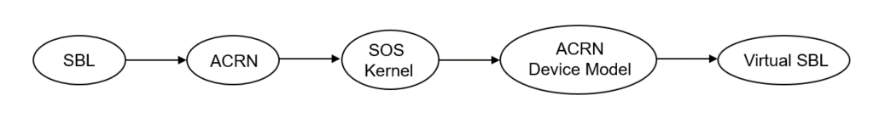
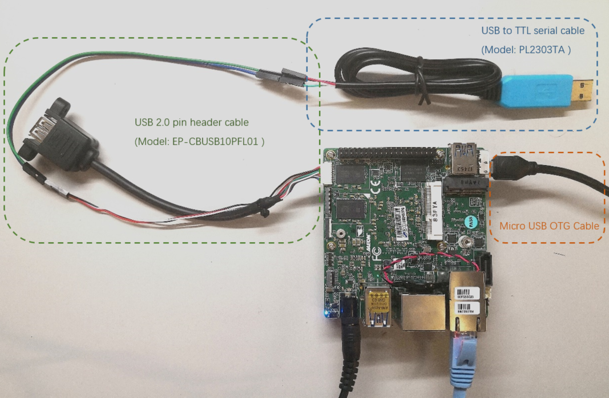
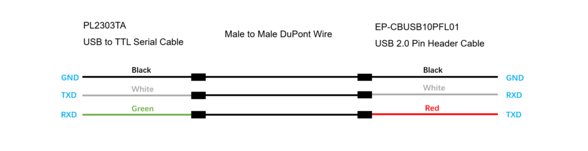
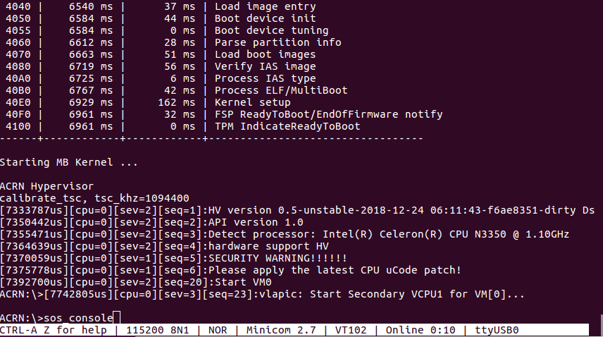

.. _using-sbl-up2:

Using SBL on UP2 Board
######################

This document builds on the :ref:`getting-started-up2`, and explains how to use
SBL instead of UEFI to boot UP2 board.

Slim Bootloader is an open-source boot firmware solution,
built from the ground up to be secure, lightweight, and highly
optimized while leveraging robust tools and libraries from
the EDK II framework. For more information about booting ACRN with SBL,
please visit `<https://slimbootloader.github.io/how-tos/boot-acrn.html>`_.

We show a verified Boot Sequence with SBL on an Intel Architecture platform UP2,
and the boot process proceeds as follows:

#. SBL verifies and boots the ACRN hypervisor and Service OS kernel
#. Service OS kernel verifies and loads ACRN Device Model and vSBL
#. vSBL starts the User-side verified boot process

Prerequisites
*************

The following hardware and software are required to use SBL on an UP2 board:

* UP2 kit (`Model N3350 <https://up-shop.org/up-boards/94-up-squared-celeron-duo-core-4gb-memory32gb-emmc.html>`_)
* `USB 2.0 Pin Header Cable <https://up-shop.org/up-peripherals/110-usb-20-pin-header-cable.html>`_ for debug UART output
* USB to TTL Serial Cable (PL2303TA for example) for debug UART output
* 3 Pin Male To Male Jumper Cable Dupont Wire for debug UART output
* Micro USB OTG Cable for flashing
* Linux host
* Internet access

The connections between USB to TTL Serial Cable and USB 2.0 Pin Header
Cable should be:

Build SBL
*********

Follow the steps of `Building <https://slimbootloader.github.io/supported-hardware/up2.html#building>`_
and `Stitching <https://slimbootloader.github.io/supported-hardware/up2.html#stitching>`_
from `<https://slimbootloader.github.io/supported-hardware/up2.html>`_ to generate the
BIOS binary file ``<SBL_IFWI_IMAGE>``, which is the new IFWI image with SBL in BIOS region.

Flash SBL on the UP2
********************

#. Download the appropriate BIOS update for `UP2 Board <https://downloads.up-community.org/download/up-board-uefi-bios-upc1dm15/>`_.
#. Put the empty USB flash drive in your PC and format it as FAT32.
#. Decompress the BIOS zip file into the formatted drive.
#. Attach the USB disk and keyboard to the board and power it on.
#. During boot, press :kbd:`F7` on the keyboard to enter the UEFI BIOS boot menu.
#. Navigate through the following menus and select ``Built-in EFI shell``.
#. Please take note of which filesystem number ``fs*`` your USB drive is mapped to.
#. Switch to that filesystem, e.g. ``fs1:``.  (Don't forget the colon.)
#. Navigate to the path where you decompressed the update (the ``cd`` and ``ls`` commands are available here, as if in an Unix shell).

   .. code-block:: none

      Fpt_3.1.50.2222.efi -f <SBL_IFWI_IMAGE> -y

Build ACRN for UP2
******************

In Clear Linux, build out the SOS and LaaG image with these two files:

* create-up2-images.sh

.. code-block:: none

   $ wget https://raw.githubusercontent.com/projectacrn/acrn-hypervisor/master/doc/tutorials/create-up2-images.sh

* uos.json

An example of the configuration file ``uos.json``:

.. code-block:: none

   {
       "DestinationType" : "virtual",
       "PartitionLayout" : [ { "disk" : "clearlinux.img", "partition" : 1, "size" : "100M", "type" : "EFI" },
                             { "disk" : "clearlinux.img", "partition" : 2, "size" : "10G", "type" : "linux" } ],
       "FilesystemTypes" : [ { "disk" : "clearlinux.img", "partition" : 1, "type" : "vfat" },
                             { "disk" : "clearlinux.img", "partition" : 2, "type" : "ext4" } ],
       "PartitionMountPoints" : [ { "disk" : "clearlinux.img", "partition" : 1, "mount" : "/boot" },
           		          { "disk" : "clearlinux.img", "partition" : 2, "mount" : "/" } ],
       "Version": 29070,
       "Bundles": ["kernel-iot-lts2018", "openssh-server", "x11-server", "os-core", "os-core-update"]
   }

.. note::
   To generate the image with a specified version, please modify
   the "Version" argument, ``"Version": 2****`` instead
   of ``"Version": 29070`` for example.

Build SOS and LaaG image:

.. code-block:: none

   $ sudo -s
   # chmod +x create-up2-images.sh
   # ./create-up2-images.sh --images-type all --clearlinux-version 29070 --laag-json uos.json

.. note::
   You must have root privileges to run ``create-up2-images.sh``.

.. note::
   If you want to build with your own ``acrn-hypervisor``, add the ``--acrn-code-path``
   argument specifying the directory where your ``acrn-hypervisor`` is found.

.. note::
   When building images, you can modify the ``--clearlinux-version`` argument
   to a specific version (such as 29070). To generate the images of SOS only,
   modify the ``--images-type`` argument to ``sos``.

This step will generate the images of SOS and LaaG:

* sos_boot.img
* sos_rootfs.img
* up2_laag.img

Build the binary image ``partition_desc.bin`` for
GPT partitions, and change the partition layout
in ``partition_desc.ini`` if needed.

.. code-block:: none

   $ cd ~/acrn-hypervisor/doc/tutorials/doc/tutorials/
   $ sudo -s
   # python2 gpt_ini2bin.py partition_desc.ini>partition_desc.bin

We still need the configuration file ``flash_LaaG.json`` for flashing,
which is also in the directory ``~/acrn-hypervisor/doc/tutorials/``.

.. table::
      :widths: auto

      +------------------------------+---------------------------------------------------+
      | Filename                     | Description                                       |
      +==============================+===================================================+
      | sos_boot.img                 | This SOS image contains the ACRN hypervisor and   |
      |                              | SOS kernel.                                       |
      +------------------------------+---------------------------------------------------+
      | sos_rootfs.img               | This is the root filesystem image for the SOS. it |
      |                              | contains the Device Models implementation and     |
      |                              | SOS user space.                                   |
      +------------------------------+---------------------------------------------------+
      | partition_desc.bin           | This is the binary image for GPT partitions       |
      +------------------------------+---------------------------------------------------+
      | up2_laag.img                 | This is the root filesystem image for the SOS.    |
      |                              | It has an integrated kernel and userspace.        |
      +------------------------------+---------------------------------------------------+
      | flash_LaaG.json              | Configuration file for Intel Platform Flash Tool  |
      |                              | to flash SOS image + hypervisor/SOS boot image +  |
      |                              | SOS userland                                      |
      +------------------------------+---------------------------------------------------+

.. note::
   In this step, please build SOS and LaaG images in Clear Linux rather than Ubuntu.

Download and install flash tool
*******************************

#. Download Intel Platform Flash Tool Lite from
   `<https://github.com/projectceladon/tools/tree/master/platform_flash_tool_lite/latest/>`_.

#. For Ubuntu host, install `platformflashtoollite_5.8.9.0_linux_x86_64.deb
   <https://github.com/projectceladon/tools/blob/master/platform_flash_tool_lite/latest/platformflashtoollite_5.8.9.0_linux_x86_64.deb>`_
   for example.

SOS and LaaG Installation
*************************

#. Connect a USB cable from the debug board to your Ubuntu host machine,
   and run the following command to verify that its USB serial port is
   discovered and showing under ``/dev``.

   .. code-block:: none

       $ ls /dev/ttyUSB*
       /dev/ttyUSB0

#. Connect to board via ``minicom``, and use ``/dev/ttyUSB0`` for example:

   .. code-block:: none

       $ sudo minicom -s /dev/ttyUSB0

   .. note::
      Please verify the minicom serial port settings are 115200 8N1 and
      both HW and SW flow control are turned off.

#. When you see following console log, please press any key to enter
   shell command:

   .. code-block:: none

       ====================Os Loader====================

       Press any key within 2 second(s) to enter the command shell

       Shell>

#. Swap the boot sequence of ``DevType: MEM`` to ``Idx:0``:

   .. code-block:: none

      Shell> boot
      Boot options (in HEX):

      Idx|ImgType|DevType|DevNum|Flags|HwPart|FsType|SwPart|File/Lbaoffset
        0|      0|   MMC |    0 |   0 |    0 |  RAW |    1 | 0x0
        1|      4|   MEM |    0 |   0 |    0 |  RAW |    0 | 0x0

      SubCommand:
        s   -- swap boot order by index
        a   -- modify all boot options one by one
        q   -- quit boot option change
        idx -- modify the boot option specified by idx (0 to 0x1)
      s
      Updated the Boot Option List
      Boot options (in HEX):

      Idx|ImgType|DevType|DevNum|Flags|HwPart|FsType|SwPart|File/Lbaoffset
        0|      4|   MEM |    0 |   0 |    0 |  RAW |    0 | 0x0
        1|      0|   MMC |    0 |   0 |    0 |  RAW |    1 | 0x0

#. Exit and reboot to fastboot mode:

   .. code-block:: none

       Shell> exit

       ...

        40E0 |  175118 ms |     158 ms | Kernel setup
        40F0 |  175144 ms |      26 ms | FSP ReadyToBoot/EndOfFirmware notify
        4100 |  175144 ms |       0 ms | TPM IndicateReadyToBoot
       ------+------------+------------+----------------------------------

       Starting MB Kernel ...

        abl cmd 00: console=ttyS0,115200
        abl cmd 00 length: 20
        abl cmd 01: fw_boottime=175922
        abl cmd 01 length: 18
       boot target: 1
       target=1
       Enter fastboot mode ...
       Start Send HECI Message: EndOfPost
       HECI sec_mode 00000000
       GetSeCMode successful
       GEN_END_OF_POST size is 4
       uefi_call_wrapper(SendwACK) =  0
       Group    =000000FF
       Command  =0000000C
       IsRespone=00000001
       Result   =00000000
       RequestedActions   =00000000
       USB for fastboot transport layer selected

#. When UP2 board is in fastboot mode, you should be able
   see the device in Platform Flash Tool. Select the
   file ``flash_LaaG.json`` and modify ``Configuration``
   to ``SOS_and_LaaG``. Click ``Start to flash`` to flash images.

   .. image:: images/platformflashtool_start_to_flash.png
      :align: center

Boot to SOS
***********
After flashing, UP2 board will automatically reboot and
boot to ACRN hypervisor. And login SOS by following command:

Launch UOS
**********
Run the ``launch_uos.sh`` script to launch the UOS:

.. code-block:: none

   $ cd ~
   $ wget https://raw.githubusercontent.com/projectacrn/acrn-hypervisor/master/doc/tutorials/launch_uos.sh
   $ sudo ./launch_uos.sh -V 1

**Congratulations**, you are now watching the User OS booting up!
