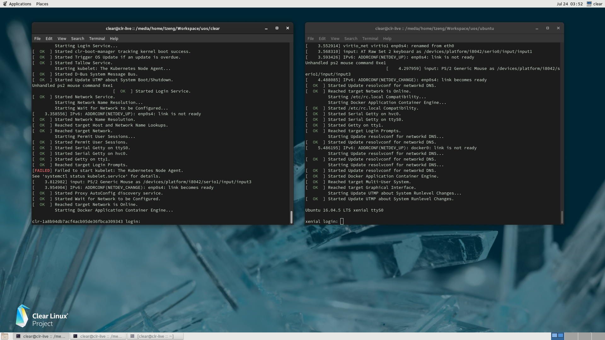

.. _using_sdc2_mode_on_nuc:

Launch Two User VMs on NUC using SDC2 Scenario
##############################################

Starting with the ACRN v1.2 release, the ACRN hypervisor supports a new
Software Defined Cockpit scenario SDC2, where up to three User VMs
running potentially different OSes, can be launched from the Service VM.

This tutorial provides step-by-step instructions for enabling this SDC2
scenario on an Intel NUC and activate two post-launched User VMs. One of
these User VMs will be running Clear Linux, the other Ubuntu. The same
process can be applied to launch a third Linux VM as well.

ACRN Service VM Setup
*********************

Follow the steps in :ref:`getting-started-apl-nuc` to set up ACRN on an
Intel NUC. The target device must be capable of launching a Clear Linux
User VM as a starting point.

Re-build ACRN UEFI Executable
*****************************

The ACRN prebuilt UEFI executable ``acrn.efi`` is compiled for the
single post-launched VM ``SDC scenario`` by default.  To activate additional
post-launched VMs, you need to enable the ``SDC2 scenario`` and rebuild
the UEFI executable using the following steps:

#. Refer to :ref:`getting-started-building` to set up the development environment
   for re-compiling the UEFI executable from the ACRN source tree.

#. Enter the ``hypervisor`` directory under the ACRN source tree and use
   menuconfig to reconfigure the ACRN hypervisor for SDC2 scenario. The
   following example starts with the configurations for the
   ``kbl-nuc-i7`` board as a template.  You can specify another board type
   which is closer to your target system.

   .. code-block:: bash

      $ cd hypervisor/
      $ make defconfig BOARD=kbl-nuc-i7
      $ make menuconfig

   .. figure:: images/sdc2-defconfig.png
      :align: center
      :width: 600px
      :name: Reconfigure the ACRN hypervisor

#. Select ``Software Defined Cockpit 2`` option for the **ACRN Scenario** configuration:

   .. figure:: images/sdc2-selected.png
      :align: center
      :width: 600px
      :name: Select the SDC2 scenario option

#. Press :kbd:`D` to save the minimum configurations to a default file ``defconfig``,
   then press :kbd:`Q` to quit the menuconfig script.

   .. figure:: images/sdc2-save-mini-config.png
      :align: center
      :width: 600px
      :name: Save the customized configurations

#. Create a new BOARD configuration (say ``mydevice``) with the SDC2
   scenario you just enabled. Replace the following ``kbl-nuc-i7`` soft
   linked target by the board type you specified in the previous step (if
   different):

   .. code-block:: bash

      $ cp defconfig arch/x86/configs/mydevice.config
      $ ln -s kbl-nuc-i7 arch/x86/configs/mydevice

#. Go to the root of ACRN source tree to build the ACRN UEFI executable
   with the customized configurations:

   .. code-block:: bash

      $ cd ..
      $ make FIRMWARE=uefi BOARD=mydevice

#. Copy the generated ``acrn.efi`` executable to the ESP partition.
   (You may need to mount the ESP partition if it's not mounted.)

   .. code-block:: bash

      $ sudo mount /dev/sda1 /boot
      $ sudo cp build/hypervisor/acrn.efi /boot/EFI/acrn/acrn.efi

#. Reboot the ACRN hypervisor and the Service VM.

Launch User VMs with predefined UUIDs
*************************************

In the SDC2 scenario, each User VMs launched by the ACRN device model ``acrn-dm``
must use one of the following UUIDs:

* ``d2795438-25d6-11e8-864e-cb7a18b34643``
* ``495ae2e5-2603-4d64-af76-d4bc5a8ec0e5``
* ``38158821-5208-4005-b72a-8a609e4190d0``

As shown below, add the ``-U`` parameter to the ``launch_uos.sh`` script
to attach the specific VM through an ``acrn-dm`` command.  For example, the
following code snippet is used to launch VM1:

.. code-block:: none
   :emphasize-lines: 9

   acrn-dm -A -m $mem_size -c $2 -s 0:0,hostbridge -s 1:0,lpc -l com1,stdio \
    -s 2,pci-gvt -G "$3" \
    -s 5,virtio-console,@pty:pty_port \
    -s 6,virtio-hyper_dmabuf \
    -s 3,virtio-blk,clear-27550-kvm.img \
    -s 4,virtio-net,tap0 \
    $logger_setting \
    --mac_seed $mac_seed \
    -U d2795438-25d6-11e8-864e-cb7a18b34643 \
    -k /usr/lib/kernel/default-iot-lts2018 \
    -B "root=/dev/vda3 rw rootwait maxcpus=$2 nohpet console=tty0 console=hvc0 \
    console=ttyS0 no_timer_check ignore_loglevel log_buf_len=16M \
    consoleblank=0 tsc=reliable i915.avail_planes_per_pipe=$4 \
    i915.enable_hangcheck=0 i915.nuclear_pageflip=1 i915.enable_guc_loading=0 \
    i915.enable_guc_submission=0 i915.enable_guc=0" $vm_name

Likewise, the following code snippet specifies a different UUID and a
different network tap device ``tap1`` to launch VM2 and connect VM2 to
the network:

.. code-block:: none
   :emphasize-lines: 2,6,10

   acrn-dm -A -m $mem_size -c $2 -s 0:0,hostbridge -s 1:0,lpc -l com1,stdio \
    -s 2,pci-gvt -G "$3" \
    -s 5,virtio-console,@pty:pty_port \
    -s 6,virtio-hyper_dmabuf \
    -s 3,virtio-blk,ubuntu-16.04.img \
    -s 4,virtio-net,tap1 \
    -s 7,virtio-rnd \
    $logger_setting \
    --mac_seed $mac_seed \
    -U 495ae2e5-2603-4d64-af76-d4bc5a8ec0e5 \
    -k /usr/lib/kernel/default-iot-lts2018 \
    -B "root=/dev/vda rw rootwait maxcpus=$2 nohpet console=tty0 console=hvc0 \
    console=ttyS0 no_timer_check ignore_loglevel log_buf_len=16M \
    consoleblank=0 tsc=reliable i915.avail_planes_per_pipe=$4 \
    i915.enable_hangcheck=0 i915.nuclear_pageflip=1 i915.enable_guc_loading=0 \
    i915.enable_guc_submission=0 i915.enable_guc=0" $vm_name

.. note::
   The i915 GPU supports three hardware pipes to drive the displays,
   however only certain products are designed with circuitry needed to
   connect to three external displays.  On a system supporting two external
   displays, because the primary display is assigned to the Service VM at
   boot time, you may remove the ``-s 2,pci-gvt -G "$3"`` options in one of
   the previous VM-launching example scripts to completely disable the
   GVT-g feature for that VM.  Refer the :ref:`APL_GVT-g-hld` for
   detailed information.

Here's a screen shot of the resuting launch of the Clear Linux and Ubuntu
User VMs, with a Clear Linux Service VM:

