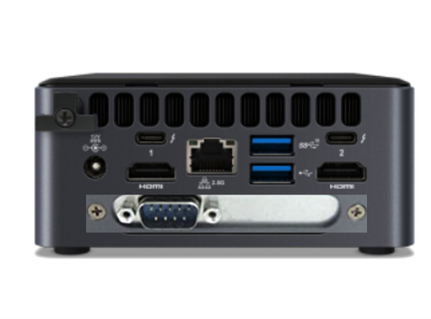
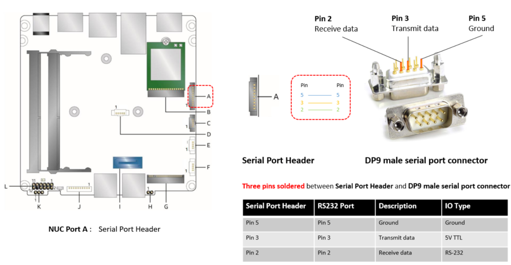
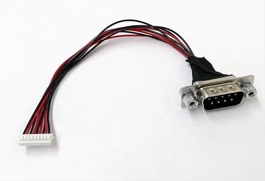
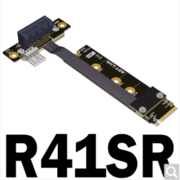
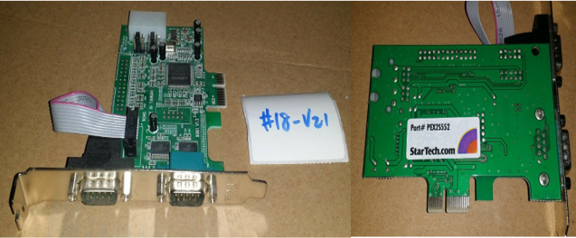
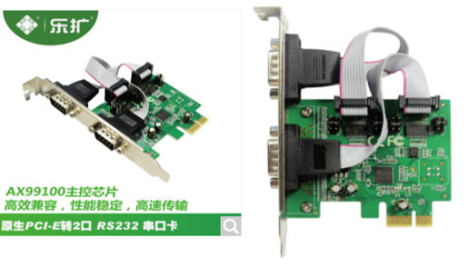
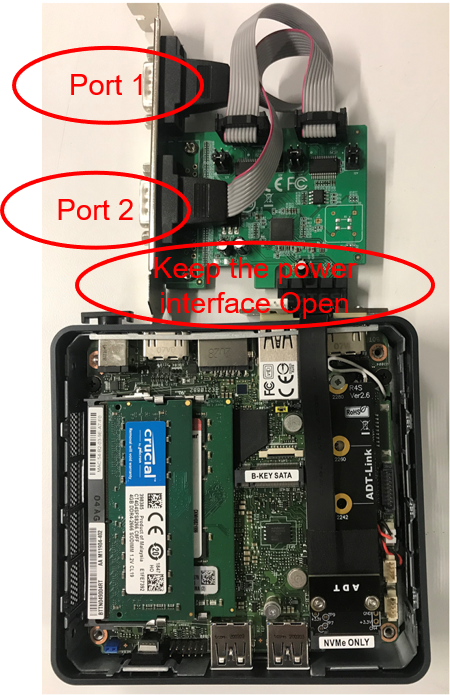

.. _connect_serial_port:

Enable Serial Port on NUC
#########################

Option 1: Using the Serial Port on TGL Intel NUC
================================================
 
You can enable the serial console on the
`TGL Intel NUC <https://ark.intel.com/content/www/us/en/ark/products/205594/intel-nuc-11-pro-kit-nuc11tnhi5.html?wapkw=NUC11TNHi5>`_
(NUC11TNHi5). The TGL Intel NUC has a serial port header that you can
expose with a serial DB9 header cable. (The Intel NUC has a punch-out hole for
mounting the serial connector.)

   TGL Intel NUC with populated serial port punchout

You can `purchase
<https://www.amazon.com/dp/B07BV1W6N8/ref=cm_sw_r_cp_ep_dp_wYm0BbABD5AK6>`_
such a cable or you can build it yourself;
refer to the `TGL Intel NUC product specification
<https://ark.intel.com/content/www/us/en/ark/products/205594/intel-nuc-11-pro-kit-nuc11tnhi5.html>`_
as shown below:

   NUC11TNH serial port header details

   NUC11TNH `serial port header to RS232 cable
   <https://www.amazon.com/dp/B07BV1W6N8/ref=cm_sw_r_cp_ep_dp_wYm0BbABD5AK6>`_

You'll also need an `RS232 DB9 female to USB cable
<https://www.amazon.com/Adapter-Chipset-CableCreation-Converter-Register/dp/B0769DVQM1>`_
or an `RS232 DB9 female/female (NULL modem) cross-over cable
<https://www.amazon.com/SF-Cable-Null-Modem-RS232/dp/B006W0I3BA>`_
to connect to your host system.

Note that If you want to use the RS232 DB9 female/female cable, choose
the **cross-over** type rather than **straight-through** type.

Option 2: Enabling PCIe Serial Port on TGL Intel NUC
====================================================

If there is no internal serial port header on your NUC, you can enable the PCIe serial port to debug the issues effeciently.
Most of the NUCs don't have a PCIe interface but have an NVMe M.2 interface, so the additional M.2 to PCIe adaptor is needed to 
enable the PCIe serial port on the NUC. You can buy the `adaptor 
<https://item.jd.com/10025455296900.html>`_ first and then buy the PCIe serial card with `StarTech 2 Port Native PCI Express 
<https://www.ebay.ca/i/351912927278>`_  or `IO-PCE99100-2S <https://item.jd.com/1126612955.html>`_.
Both of them are verified with this
`commit <https://github.com/projectacrn/acrn-hypervisor/commit/9e838248c3ce4d6b68e1c5b068d10d566a06db10>`_.

   NVMe M.2 to PCIe adaptor

   StarTech 2 Port Native PCI Express

   IO-PCE99100-2S

    
Check the BDF Information
*************************

Connect as in following figure, boot into native, and then check the BDF
information of the adapter using: ``lspci``.

   PCIe Serial Connection on NUC

.. code-block:: bash
   
   01:00.0 Serial controller: Asix Electronics Corporation Device 9100
   01:00.1 Serial controller: Asix Electronics Corporation Device 9100

Convert the BDF to Hex Format
*****************************

Refer this :ref:`hv-parameters` to change bdf 01:00.1 to Hex format: 0x101;
then add it to the grub menu:

.. code-block:: bash

   multiboot2 /boot/acrn.bin  root=PARTUUID="b1bebafc-2b06-43e2-bf6a-323337daebc0" uart=bdf@0x101

.. Note::

   ``uart=bdf@0x100`` for port 1

   ``uart=bdf@0x101`` for port 2

   ``uart=bdf@0x101`` is preferred for the industry scenario; otherwise, it can't
   input in the Hypervisor console after the Service VM boots up.
   There is no such limitation for the hybrid or hybrid_rt scenarios.
