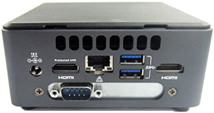
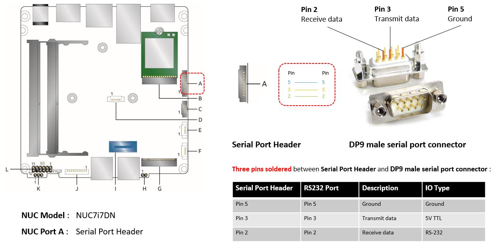

.. _connect_serial_port:

Using the Serial Port on KBL NUC
================================

You can enable the serial console on the
`KBL NUC <https://www.amazon.com/Intel-Business-Mini-Technology-BLKNUC7i7DNH1E/dp/B07CCQ8V4R>`_
(NUC7i7DNH). The KBL NUC has a serial port header you can
expose with a serial DB9 header cable. (The NUC has a punch out hole for
mounting the serial connector.)

   KBL NUC with populated serial port punchout

You can `purchase
<https://www.amazon.com/dp/B07BV1W6N8/ref=cm_sw_r_cp_ep_dp_wYm0BbABD5AK6>`_
such a cable or you can build it yourself;
refer to the `KBL NUC product specification
<https://www.intel.com/content/dam/support/us/en/documents/mini-pcs/nuc-kits/NUC7i7DN_TechProdSpec.pdf>`_
as shown below:

   KBL serial port header details

.. figure:: images/KBL-serial-port-header-to-RS232-cable.jpg
   :scale: 80

   KBL `serial port header to RS232 cable
   <https://www.amazon.com/dp/B07BV1W6N8/ref=cm_sw_r_cp_ep_dp_wYm0BbABD5AK6>`_

You'll also need an `RS232 DB9 female to USB cable
<https://www.amazon.com/Adapter-Chipset-CableCreation-Converter-Register/dp/B0769DVQM1>`_,
or an `RS232 DB9 female/female (NULL modem) cross-over cable
<https://www.amazon.com/SF-Cable-Null-Modem-RS232/dp/B006W0I3BA>`_
to connect to your host system.

Note that If you want to use the RS232 DB9 female/female cable, choose
the **cross-over** type rather than **straight-through** type.
