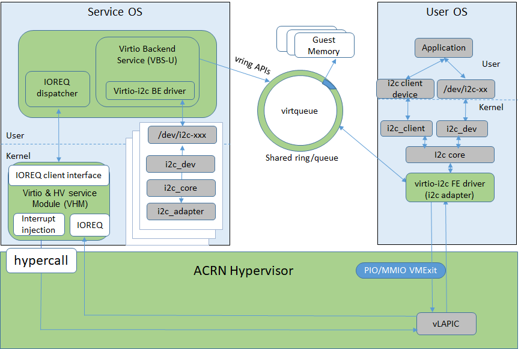
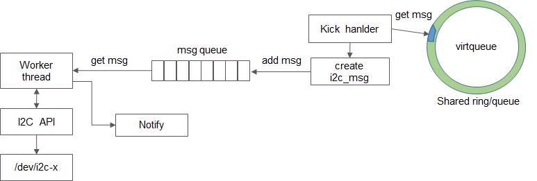

 .. _virtio_i2c:

Virtio-i2c
##########

Virtio-i2c provides a virtual I2C adapter that supports mapping multiple slave devices under multiple native I2C adapters to one virtio I2C adapter. The address for the slave device is not changed. Virtio-i2c also provides an interface to add an acpi node for slave devices so that the slave device driver in the guest OS does not need to change.

:numref:`virtio-i2c-1` below shows the virtio-i2c architecture.

   Virtio-i2c Architecture

Virtio-i2c is implemented as a virtio legacy device in the ACRN device model (DM) and is registered as a PCI virtio device to the guest OS. The Device ID of virtio-i2c is 0x860A and the Sub Device ID is 0xFFF6.

Virtio-i2c uses one **virtqueue** to transfer the I2C msg that is received from the I2C core layer. Each I2C msg is translated into three parts:

- Header: includes addr, flags, and len.
- Data buffer: includes the pointer to msg data.
- Status: includes the process results at the backend.

In the backend kick handler, data is obtained from the virtqueue, which reformats the data to a standard I2C message and then sends it to a message queue that is maintained in the backend. A worker thread is created during the initiate phase; it receives the I2C message from the queue and then calls the I2C APIs to send to the native I2C adapter.

When the request is done, the backend driver updates the results and notifies the frontend. The msg process flow is shown in :numref:`virtio-process-flow` below.

   Message Process Flow

**Usage:**
-s <slot>,virtio-i2c,<bus>[:<slave_addr>[@<node>]][:<slave_addr>[@<node>]][,<bus>[:<slave_addr>[@<node>]][:<slave_addr>][@<node>]]

   bus:
   The bus number for the native I2C adapter; “2” means “/dev/i2c-2”.

   slave_addr:
   he address for the native slave devices such as “1C”, “2F”...

   @:
   The prefix for the acpi node.

   node:
   The acpi node name supported in the current code. You can find the supported name in the acpi_node_table[] from the source code. Currently, only ‘cam1’, ‘cam2’, and ‘hdac’ are supported for MRB. These nodes are platform-specific.

**Example:**

  -s 19,virtio-i2c,0:70@cam1:2F,4:1C

This adds slave devices 0x70 and 0x2F under the native adapter /dev/i2c-0, and 0x1C under /dev/i2c-6 to the virtio-i2c adapter. Since 0x70 includes '@cam1', acpi info is also added to it. Since 0x2F and 0x1C have '@<node>', no acpi info is added to them.

**Simple use case:**

When launched with this cmdline:

  -s 19,virtio-i2c,4:1C

a virtual I2C adapter will appear in the guest OS:

.. code-block:: none

   root@clr-d5f61ae5f5224e59bb1727db3b5f5d4e ~ # ./i2cdetect -y -l
   i2c-3   i2c            DPDDC-A                       I2C adapter
   i2c-1   i2c            i915 gmbus dpc                I2C adapter
   i2c-6   i2c            i2c-virtio                    I2C adapter
   i2c-4   i2c            DPDDC-B                       I2C adapter
   i2c-2   i2c            i915 gmbus misc               I2C adapter
   i2c-0   i2c            i915 gmbus dpb                I2C adapter
   i2c-5   i2c            DPDDC-C                       I2C adapter

You can find the slave device 0x1C under the virtio I2C adapter i2c-6:

.. code-block:: none

        0  1  2  3  4  5  6  7  8  9  a  b  c  d  e  f
   00:          -- -- -- -- -- -- -- -- -- -- -- -- --
   10: -- -- -- -- -- -- -- -- -- -- -- -- 1c -- -- --
   20: -- -- -- -- -- -- -- -- -- -- -- -- -- -- -- --
   30: -- -- -- -- -- -- -- -- -- -- -- -- -- -- -- --
   40: -- -- -- -- -- -- -- -- -- -- -- -- -- -- -- --
   50: -- -- -- -- -- -- -- -- -- -- -- -- -- -- -- --
   60: -- -- -- -- -- -- -- -- -- -- -- -- -- -- -- --
   70: -- -- -- -- -- -- -- --

You can dump the i2c device if it is supported:

.. code-block:: none

   root@clr-d5f61ae5f5224e59bb1727db3b5f5d4e ~ # ./i2cdump -f -y 6 0x1C
   No size specified (using byte-data access)
        0  1  2  3  4  5  6  7  8  9  a  b  c  d  e  f    0123456789abcdef
   10: ff ff 00 22 b2 05 00 00 00 00 00 00 00 00 00 00    ..."??..........
   20: 00 00 00 ff ff ff ff ff 00 00 00 ff ff ff ff ff    ................
   30: ff ff ff ff ff ff ff ff ff ff ff ff ff ff ff 00    ................
   40: 00 00 00 ff ff ff ff ff ff ff ff ff ff ff ff ff    ................
   50: ff ff ff ff ff ff ff ff ff ff ff ff ff ff ff ff    ................
   60: 00 10 00 00 00 00 00 00 00 00 00 00 00 00 00 00    .?..............
   70: ff ff 00 ff 10 10 ff ff ff ff ff ff ff ff ff ff    ....??..........
   80: ff ff ff ff ff ff ff ff ff ff ff ff ff ff ff ff    ................
   90: ff ff ff ff ff ff ff ff ff ff ff ff ff ff ff ff    ................
   a0: ff ff ff ff ff ff f8 ff 00 00 ff ff 00 ff ff ff    ......?.........
   b0: ff ff ff ff ff ff ff ff ff ff ff ff ff ff ff ff    ................
   c0: 00 ff 00 00 ff ff ff 00 00 ff ff ff ff ff ff ff    ................
   d0: ff ff ff ff ff ff ff ff ff ff ff ff ff ff ff ff    ................
   e0: 00 ff 06 00 03 fa 00 ff ff ff ff ff ff ff ff ff    ..?.??..........
   f0: ff ff ff ff ff ff ff ff ff ff ff ff ff ff ff ff    ................

Note that the virtual I2C bus number has no relationship with the native I2C bus number; it is auto-generated by the guest OS.

