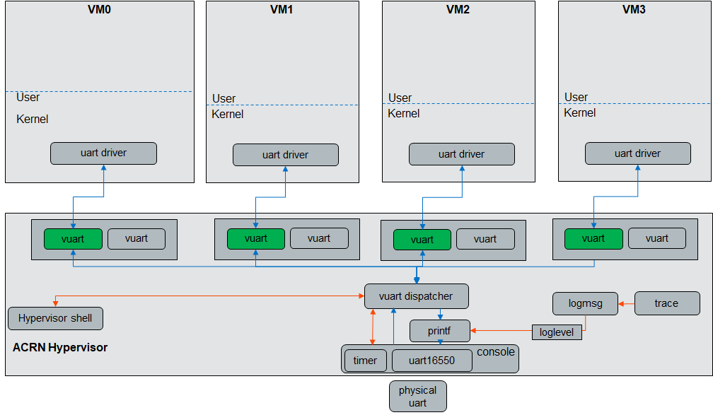
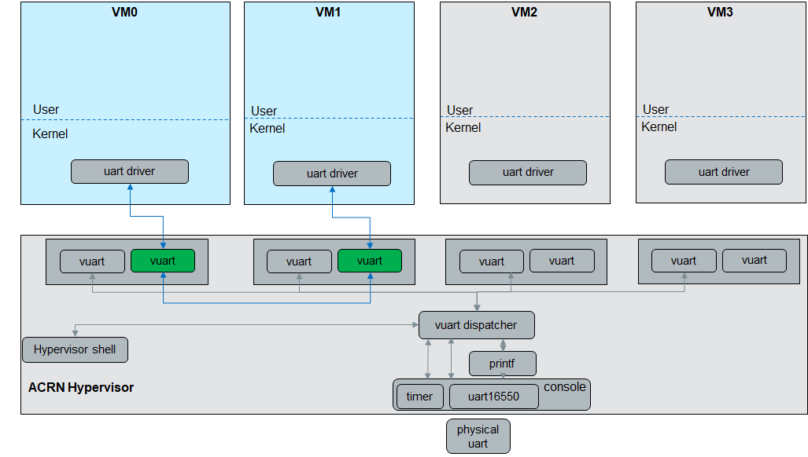
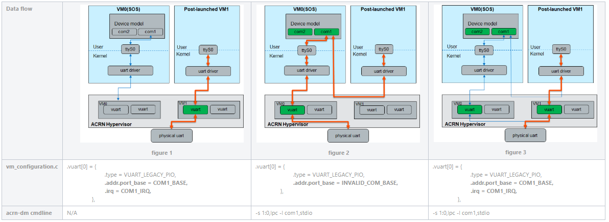

.. _vuart_config:

Enable vUART Configurations
###########################

Introduction
============

The virtual universal asynchronous receiver-transmitter (vUART) supports two functions: one is the console, the other is communication. vUART only works on a single function.

Currently, only two vUART configurations are added to the
``misc/vm_configs/scenarios/<xxx>/vm_configuration.c`` file, but you can change the value in it.

.. code-block:: none

                .vuart[0] = {
                        .type = VUART_LEGACY_PIO,
                        .addr.port_base = INVALID_COM_BASE,
                },
                .vuart[1] = {
                        .type = VUART_LEGACY_PIO,
                        .addr.port_base = INVALID_COM_BASE,
                }

**vuart[0]** is initiated as the **console** port.

**vuart[1]** is initiated as a **communication** port.

Console enable list
===================

+-----------------+-----------------------+--------------------+----------------+----------------+
| Scenarios       | vm0                   | vm1                | vm2            | vm3            |
+=================+=======================+====================+================+================+
| SDC             | Service VM            | Post-launched      | Post-launched  |                |
|                 | (vuart enable)        |                    |                |                |
+-----------------+-----------------------+--------------------+----------------+----------------+
| Hybrid          | Pre-launched (Zephyr) | Service VM         | Post-launched  |                |
|                 | (vuart enable)        | (vuart enable)     |                |                |
+-----------------+-----------------------+--------------------+----------------+----------------+
| Industry        | Service VM            | Post-launched      | Post-launched  | Post-launched  |
|                 | (vuart enable)        |                    | (vuart enable) |                |
+-----------------+-----------------------+--------------------+----------------+----------------+
| Logic_partition | Pre-launched          | Pre-launched RTVM  | Post-launched  |                |
|                 | (vuart enable)        | (vuart enable)     | RTVM           |                |
+-----------------+-----------------------+--------------------+----------------+----------------+

How to configure a console port
===============================

To enable the console port for a VM, change only the ``port_base`` and ``irq``. If the irq number is already in use in your system (``cat /proc/interrupt``), choose another irq number. If you set the ``.irq =0``, the vuart will work in polling mode.

- COM1_BASE (0x3F8) + COM1_IRQ(4)
- COM2_BASE (0x2F8) + COM2_IRQ(3)
- COM3_BASE (0x3E8) + COM3_IRQ(6)
- COM4_BASE (0x2E8) + COM4_IRQ(7)

Example:

.. code-block:: none

   .vuart[0] = {
                        .type = VUART_LEGACY_PIO,
                        .addr.port_base = COM1_BASE,
                        .irq = COM1_IRQ,
                },

How to configure a communication port
=====================================

To enable the communication port, configure ``vuart[1]`` in the two VMs that want to communicate.

The port_base and irq should differ from the ``vuart[0]`` in the same VM.

**t_vuart.vm_id** is the target VM's vm_id, start from 0. (0 means VM0)

**t_vuart.vuart_id** is the target vuart index in the target VM. start from 1. (1 means vuart[1])

Example:

.. code-block:: none

   /* VM0 */
   ...
   /* VM1 */
   .vuart[1] = {
                        .type = VUART_LEGACY_PIO,
                        .addr.port_base = COM2_BASE,
                        .irq = COM2_IRQ,
                        .t_vuart.vm_id = 2U,
                        .t_vuart.vuart_id = 1U,
                },
   ...
   /* VM2 */
   .vuart[1] = {
                        .type = VUART_LEGACY_PIO,
                        .addr.port_base = COM2_BASE,
                        .irq = COM2_IRQ,
                        .t_vuart.vm_id = 1U,
                        .t_vuart.vuart_id = 1U,
                },

Communication vUART enable list
===============================

+-----------------+-----------------------+--------------------+---------------------+----------------+
| Scenarios       | vm0                   | vm1                | vm2                 | vm3            |
+=================+=======================+====================+=====================+================+
| SDC             | Service VM            | Post-launched      | Post-launched       |                |
+-----------------+-----------------------+--------------------+---------------------+----------------+
| Hybrid          | Pre-launched (Zephyr) | Service VM         | Post-launched       |                |
|                 | (vuart enable COM2)   | (vuart enable COM2)|                     |                |
+-----------------+-----------------------+--------------------+---------------------+----------------+
| Industry        | Service VM            | Post-launched      | Post-launched RTVM  | Post-launched  |
|                 | (vuart enable COM2)   |                    | (vuart enable COM2) |                |
+-----------------+-----------------------+--------------------+---------------------+----------------+
| Logic_partition | Pre-launched          | Pre-launched RTVM  |                     |                |
+-----------------+-----------------------+--------------------+---------------------+----------------+

Launch script
=============

-  *-s 1:0,lpc -l com1,stdio*
   This option is only needed for WaaG and VxWorks (and also when using OVMF). They depend on the ACPI table, and only ``acrn-dm`` can provide the ACPI table for UART.

-  *-B " ....,console=ttyS0, ..."*
   Add this to the kernel-based system.

Test the communication port
===========================

After you have configured the communication port in hypervisor, you can access the corresponding port. For example, in Clear Linux:

1. With ``echo`` and ``cat``

   On VM1: ``# cat /dev/ttyS1``

   On VM2: ``# echo "test test" > /dev/ttyS1``

   you can find the message from VM1 ``/dev/ttyS1``.

   If you are not sure which port is the communication port, you can run ``dmesg | grep ttyS`` under the Linux shell to check the base address. If it matches what you have set in the ``vm_configuration.c`` file, it is the correct port.

#. With minicom

   Run ``minicom -D /dev/ttyS1`` on both VM1 and VM2 and enter ``test`` in VM1's minicom. The message should appear in VM2's minicom. Disable flow control in minicom.

#. Limitations

   -  The msg cannot be longer than 256 bytes.
   -  This cannot be used to transfer files because flow control is not supported so data may be lost.

vUART design
============

**Console vUART**

**Communication vUART (between VM0 and VM1)**

COM port configurations for Post-Launched VMs
=============================================

For a post-launched VM, the ``acrn-dm`` cmdline also provides a COM port configuration:

  ``-s 1:0,lpc -l com1,stdio``

This adds ``com1 (0x3f8)`` and ``com2 (0x2f8)`` modules in the Guest VM, including the ACPI info for these two ports.

**Data Flows**

Three different data flows exist based on how the post-launched VM is started, as shown in the diagram below.

Figure 1 data flow: The post-launched VM is started with the vUART enabled in the hypervisor configuration file only.

Figure 2 data flow: The post-launched VM is started with the ``acrn-dm`` cmdline of ``-s 1:0,lpc -l com1,stdio`` only.

Figure 3 data flow: The post-launched VM is started with both vUART enabled and the ``acrn-dm`` cmdline of ``-s 1:0,lpc -l com1,stdio``.

.. note::
   For operating systems such as VxWorks and Windows that depend on the ACPI table to probe the uart driver, adding the vuart configuration in the hypervisor is not sufficient. Currently, we recommend that you use the configuration in the figure 3 data flow. This may be refined in the future.

