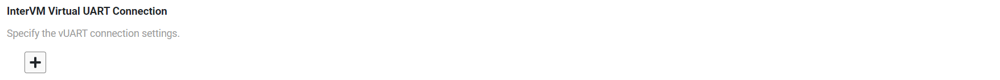
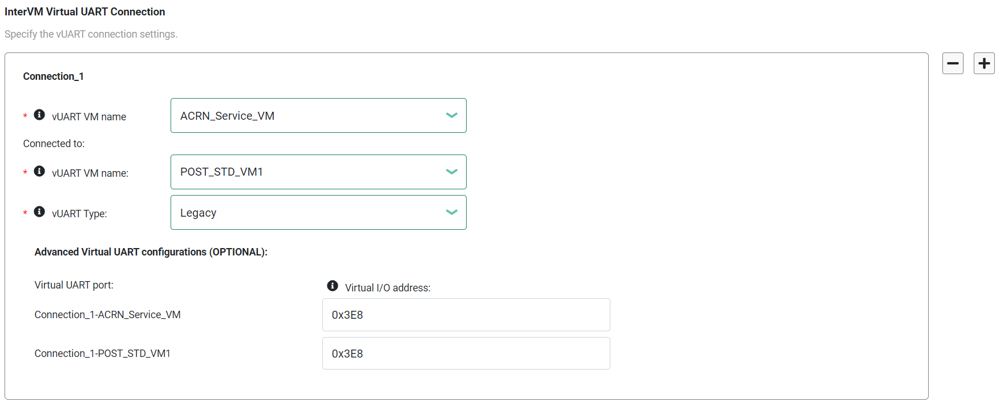

.. _vuart_config:

Enable vUART Configurations
###########################

About vUART
============

A virtual universal asynchronous receiver/transmitter (vUART) can be a console
port or a communication port.

A vUART can exchange data between the hypervisor and a VM
or between two VMs. Typical use cases of a vUART include:

* Access the console of a VM from the hypervisor or another VM. A VM console,
  when enabled by the OS in that VM, typically provides logs and a shell to
  log in and execute commands. (vUART console)

* Exchange user-specific, low-speed data between two VMs. (vUART communication)

To the VMs, the vUARTs are presented in a 8250-compatible manner.

To exchange high-speed (for example, megabytes or gigabytes per second) data
between two VMs, you can use the inter-VM shared memory feature
(IVSHMEM) instead.

Dependencies and Constraints
=============================

Consider the following dependencies and constraints:

* The OSes of the VMs need an 8250-compatible serial driver.

* To access the hypervisor shell, you must have a physical UART.

* Although a vUART is available to all kinds of VMs, you should not
  enable a vUART to access the console of or exchange data with a real-time VM.
  Exchanging data via a vUART imposes a performance
  penalty that could delay the response of asynchronous events in real-time VMs.

* A VM can have one console vUART and multiple communication vUARTs.

* A single vUART connection cannot support both console and communication.

Configuration Overview
======================

The :ref:`acrn_configurator_tool` lets you configure vUART connections. The
following documentation is a general overview of the configuration process.

To configure access to the console of a VM from the hypervisor, go to the **VM
Basic Parameters > Console virtual UART type**, and select a COM port.

To configure communication between two VMs, go to the **Hypervisor Global
Settings > Basic Parameters > InterVM Virtual UART Connection**. Click **+**
to add the first vUART connection.

For the connection:

#. Select the two VMs to connect.

#. Select the vUART type, either Legacy or PCI.

#. If you select Legacy, the tool displays a virtual I/O address field for each
   VM. If you select PCI, the tool displays a virtual Board:Device.Function
   (BDF) address field for each VM. In both cases, you can enter an address or
   leave it blank. If the field is blank, the tool provides an address when the
   configuration is saved.

To add another connection, click **+** on the right side of an existing
connection. Or click **-** to delete a connection.

   .. note::

      The release v3.0+ ACRN Configurator assigns COM2 (I/O address ``0x2F8``) to
      the S5 feature. A conflict will occur if you assign ``0x2F8`` to another
      connection. In our example, we'll use COM3 (I/O address ``0x3E8``).

Example Configuration
=====================

The following steps show how to configure and verify a vUART
connection between two VMs. The example extends the information provided in the
:ref:`gsg`.

#. In the ACRN Configurator, create a shared scenario with a Service VM and one
   post-launched User VM.

#. Go to **Hypervisor Global Settings > Basic Parameters > InterVM Virtual UART
   Connection**.

   a. Click **+** to add a vUART connection.

   #. Select the Service VM (ACRN_Service_VM) and the post-launched User VM
      (POST_STD_VM1).

   #. For the vUART type, this example uses ``Legacy``.

   #. For the virtual I/O address, this example uses ``0x3E8``.

   .. image:: images/configurator-vuartconn01.png
      :align: center
      :class: drop-shadow

#. Save the scenario and launch script.

#. Build ACRN, copy all the necessary files from the development computer to the
   target system, and launch the Service VM and post-launched User VM.

#. To verify the connection:

   a. In the Service VM, check the communication port via the ``dmesg | grep
      tty`` command. In this example, we know the port is ``ttyS1`` because the
      I/O address matches the address in the ACRN Configurator.

      .. code-block:: console
         :emphasize-lines: 7

         root@10239146120sos-dom0:~# dmesg |grep tty
         [    0.000000] Command line: root=/dev/nvme0n1p2 idle=halt rw rootwait console=ttyS0 console=tty0 earlyprintk=serial,ttyS0,115200 cons_timer_check consoleblank=0 no_timer_check quiet loglevel=3 i915.nuclear_pageflip=1 nokaslr i915.force_probe=* i915.enable_guc=0x7 maxcpus=16 hugepagesz=1G hugepages=26 hugepagesz=2M hugepages=388  root=PARTUUID=25302f3f-5c45-4ba4-a811-3de2b64ae6f6
         [    0.038630] Kernel command line: root=/dev/nvme0n1p2 idle=halt rw rootwait console=ttyS0 console=tty0 earlyprintk=serial,ttyS0,115200 cons_timer_check consoleblank=0 no_timer_check quiet loglevel=3 i915.nuclear_pageflip=1 nokaslr i915.force_probe=* i915.enable_guc=0x7 maxcpus=16 hugepagesz=1G hugepages=26 hugepagesz=2M hugepages=388  root=PARTUUID=25302f3f-5c45-4ba4-a811-3de2b64ae6f6
         [    0.105303] printk: console [tty0] enabled
         [    0.105319] printk: console [ttyS0] enabled
         [    1.391979] 00:03: ttyS0 at I/O 0x3f8 (irq = 4, base_baud = 115200) is a 16550A
         [    1.649819] serial8250: ttyS1 at I/O 0x3e8 (irq = 5, base_baud = 115200) is a 16550A
         [    3.394543] systemd[1]: Created slice system-serial\x2dgetty.slice.

   #. Test vUART communication:

      In the Service VM, run the following command to write ``acrn`` to the
      communication port:

      .. code-block:: console

         root@10239146120sos-dom0:~/kino# echo "acrn" > /dev/ttyS1

      In the User VM, read the communication port to confirm that ``acrn`` was
      received:

      .. code-block:: console

         $ root@intel-corei7-64:~# cat /dev/ttyS1
         acrn

Learn More
==========

ACRN supports multiple inter-VM communication methods. For a comparison, see
:ref:`inter-vm_communication`.

For details on ACRN vUART high-level design, see:

* :ref:`hv-console-shell-uart`
* :ref:`vuart_virtualization`
* :ref:`uart_virtualization`
