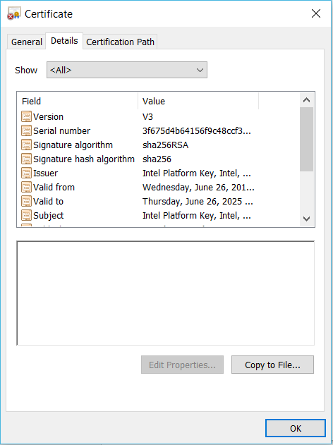
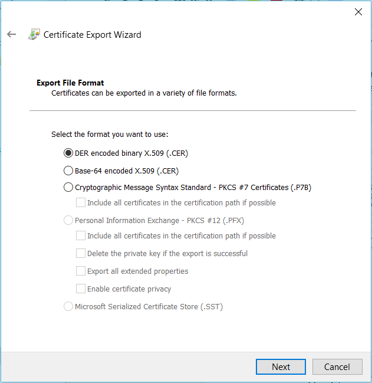
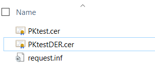
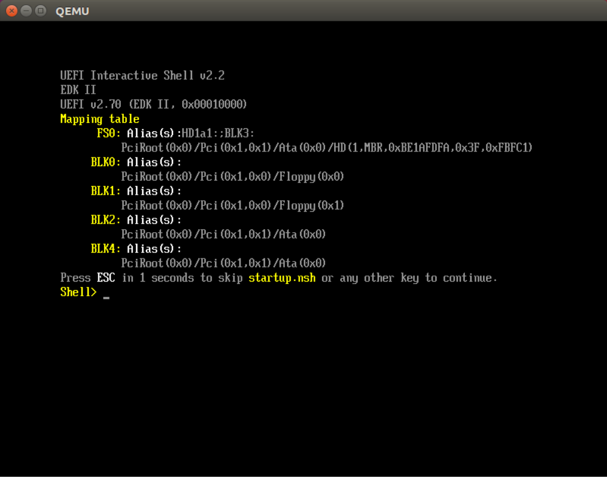
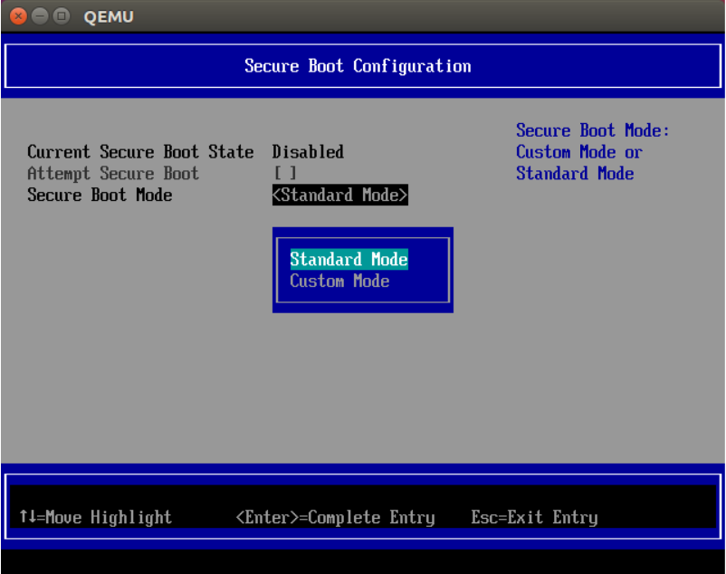
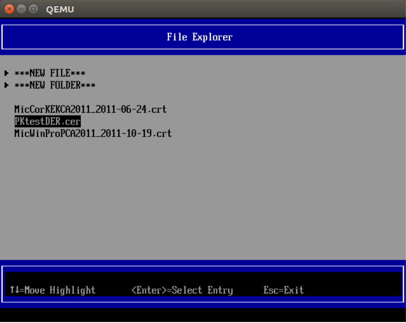
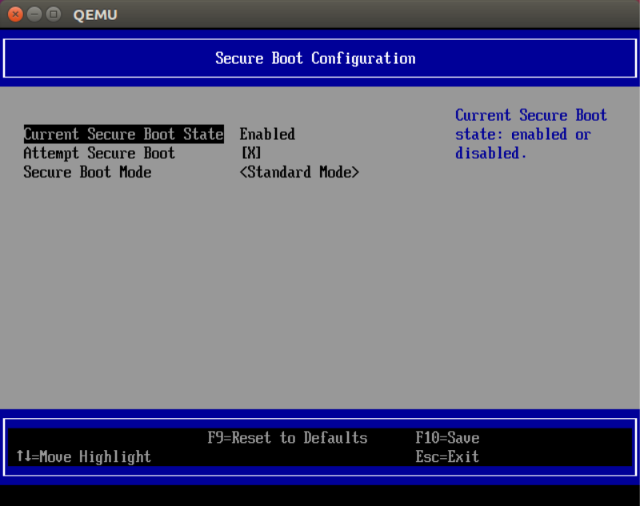

 .. _How-to-enable-secure-boot-for-windows:

How to enable secure boot for windows
=====================================

This document is the guide to enable secure boot to launch Windows 10
through OVMF on ACRNGT, including:

-  Generate Platform Key

-  Get KEK and DB from Microsoft

-  Inject PK, KEK and DB into OVMF

Generate PK (Platform Key)
==========================

In UEFI secure boot, the Platform Key establishes a trust relationship
between the platform owner and the platform firmware. According to
Microsoft document, section 1.5:
https://docs.microsoft.com/en-us/windows-hardware/manufacture/desktop/windows-secure-boot-key-creation-and-management-guidance,
PK is a self-signed certificate and owned by OEM, OEM can generate their
own PK.

Here we show two ways, openssl and Microsoft tools to generate a PK.

1. Using openssl
----------------

 1). Generate a Self-Signed Certificate as PK from a new key. 

 You will be required to answer the CSR information prompt to complete the process. 

 For example::

    $ openssl req -newkey rsa:2048 -nodes -keyout PKpriv.key -x509 -days
    365 -out PK.crt

    Generating a 2048 bit RSA private key

    ....+++

    .+++

    writing new private key to 'PKpriv.key'

    -----

    You are about to be asked to enter information that will be
    incorporated

    into your certificate request.

    What you are about to enter is what is called a Distinguished Name
    or a DN.

    There are quite a few fields but you can leave some blank

    For some fields there will be a default value,

    If you enter '.', the field will be left blank.

    -----

    Country Name (2 letter code) [AU]:CN

    State or Province Name (full name) [Some-State]:Shanghai

    Locality Name (eg, city) []:Shanghai

    Organization Name (eg, company) [Internet Widgits Pty Ltd]:Intel

    Organizational Unit Name (eg, section) []:Intel

    Common Name (e.g. server FQDN or YOUR name) []:

    Email Address []:

And you can also generate the self-signed certificate from an existing
key:

openssl req -key testpriv.key –new -x509 -days 365 -out PK.crt

 2). View the content of certificate::

    $ openssl x509 -text -noout -in PK2.crt

    Certificate:

    Data:

    Version: 3 (0x2)

    Serial Number: 10097816361374596362 (0x8c22a67aeadc3d0a)

    Signature Algorithm: sha256WithRSAEncryption

    Issuer: C=CN, ST=Shanghai, L=Shanghai, O=Intel, OU=Intel

    Validity

    Not Before: Jun 26 06:29:14 2019 GMT

    Not After : Jun 25 06:29:14 2020 GMT

    Subject: C=CN, ST=Shanghai, L=Shanghai, O=Intel, OU=Intel

    Subject Public Key Info:

    Public Key Algorithm: rsaEncryption

    Public-Key: (2048 bit)

    Modulus:

    00:9e:15:70:40:8c:b0:a7:c2:dd:45:15:e9:ab:c2:

    d9:3d:d7:32:1e:7f:ec:1d:26:e3:d3:07:2c:5c:40:

    8a:42:12:d3:31:59:2c:f0:b0:f7:3d:94:51:ae:b8:

    25:16:ab:98:97:60:68:67:80:e1:77:85:aa:f2:70:

    f3:47:fc:39:8c:9c:25:46:a8:ca:4f:aa:8f:d1:db:

    f1:50:9b:d9:b6:3d:28:bf:5c:bf:1a:52:12:4c:e2:

    04:dd:fe:04:f1:98:3a:9f:a7:ff:f9:43:43:f7:8b:

    48:48:ee:d8:2e:b1:25:26:97:ca:1f:94:1c:00:1e:

    68:8f:e1:30:3d:3c:1d:99:32:d0:d3:08:0b:ed:4c:

    4b:b4:7c:42:b9:1c:e4:ef:df:47:cf:52:37:7e:6e:

    a1:87:02:f9:23:6b:f4:22:e7:a8:8a:40:4c:5d:ff:

    f2:9f:bd:05:68:15:5c:1a:03:e3:4b:80:55:08:38:

    78:1f:e7:4c:dc:cd:49:22:ef:c0:60:4a:c2:b2:c9:

    cb:2b:5c:e2:c8:1d:ec:9e:2d:eb:ed:b1:d7:53:54:

    ea:ce:1a:f2:1c:f9:19:2e:c4:6f:fa:f2:46:bd:48:

    bc:84:f2:a7:b4:1c:0c:60:26:eb:b1:31:d2:76:24:

    df:21:0d:4e:fb:80:3d:ce:8e:a4:5c:8f:8d:b5:51:

    88:a3

    Exponent: 65537 (0x10001)

    X509v3 extensions:

    X509v3 Subject Key Identifier:

    4D:A0:DC:F6:6C:56:1E:D2:25:C5:E3:EE:5D:0C:70:ED:71:E7:72:AA

    X509v3 Authority Key Identifier:

    keyid:4D:A0:DC:F6:6C:56:1E:D2:25:C5:E3:EE:5D:0C:70:ED:71:E7:72:AA

    X509v3 Basic Constraints:

    CA:TRUE

    Signature Algorithm: sha256WithRSAEncryption

    24:0a:38:57:49:e5:35:05:58:d9:88:03:eb:3a:8c:5b:0d:88:

    70:58:ea:77:b2:4c:37:ff:87:52:b7:f3:bd:0f:6f:5e:7c:fc:

    28:16:37:19:23:d0:90:af:ed:1e:f3:36:ee:9d:66:0e:7c:07:

    5b:7d:0a:2a:fa:80:8c:6a:35:48:2d:50:9e:d2:f4:fc:d1:2a:

    ed:f5:7f:e4:d9:ec:ac:09:10:52:5c:b9:c7:68:4a:91:98:33:

    95:c3:23:4a:06:ca:ec:d3:ef:46:94:92:61:88:e4:e2:f5:db:

    c1:7a:a7:98:9d:59:0d:43:c2:2a:46:11:74:53:44:37:08:cd:

    b1:99:36:b6:3f:5e:51:f2:8c:d7:a0:0c:c5:9f:68:ba:2b:ab:

    7a:57:1f:fd:c9:44:0d:b9:39:6e:52:8c:09:8b:eb:5f:ea:3d:

    d4:3d:05:17:1a:7f:47:92:38:94:1d:e0:59:d2:66:bb:37:95:

    1d:11:4b:70:a1:89:1f:09:5a:25:dc:80:ee:27:17:7e:4a:cc:

    32:63:1d:e2:89:27:b1:44:99:9f:fb:4d:45:31:23:49:7b:ba:

    21:05:eb:d8:8a:b3:d0:72:c0:19:97:2a:59:4b:d1:12:ce:04:

    c4:c6:61:6f:19:e4:c2:fa:6a:0f:c7:70:c9:08:85:0c:65:97:

    83:41:c6:4b

 3). Convert certificate from PEM to DER

 Only DER format encoded certificate is supported. After conversion, save
 PK.der for use.

 openssl x509 -in PK.crt -outform der -out PK.der

2. Using Microsoft tools
------------------------

In Microsoft document, it introduced how to use Microsoft tools to
generate secure boot key.
https://docs.microsoft.com/en-us/windows-hardware/manufacture/desktop/secure-boot-key-generation-and-signing-using-hsm--example

Using certutil.exe to list the CSPs (Cryptographic Service Provider).

   For the detailed information of each Microsoft Cryptographic Service
   Provider, please check Microsoft document:
   https://docs.microsoft.com/en-us/windows/desktop/seccrypto/microsoft-cryptographic-service-providers.

   Here, we chose “Microsoft Strong Cryptographic Provider” for example.::

    C:\\CertReq\\test> certutil -csplist

    Provider Name: Microsoft Base Cryptographic Provider v1.0

    Provider Type: 1 - PROV\_RSA\_FULL

    Provider Name: Microsoft Base DSS and Diffie-Hellman Cryptographic
    Provider

    Provider Type: 13 - PROV\_DSS\_DH

    Provider Name: Microsoft Base DSS Cryptographic Provider

    Provider Type: 3 - PROV\_DSS

    Provider Name: Microsoft Base Smart Card Crypto Provider

    Provider Type: 1 - PROV\_RSA\_FULL

    Provider Name: Microsoft DH SChannel Cryptographic Provider

    Provider Type: 18 - PROV\_DH\_SCHANNEL

    Provider Name: Microsoft Enhanced Cryptographic Provider v1.0

    Provider Type: 1 - PROV\_RSA\_FULL

    Provider Name: Microsoft Enhanced DSS and Diffie-Hellman
    Cryptographic Provider

    Provider Type: 13 - PROV\_DSS\_DH

    Provider Name: Microsoft Enhanced RSA and AES Cryptographic Provider

    Provider Type: 24 - PROV\_RSA\_AES

    Provider Name: Microsoft RSA SChannel Cryptographic Provider

    Provider Type: 12 - PROV\_RSA\_SCHANNEL

    Provider Name: Microsoft Strong Cryptographic Provider

    Provider Type: 1 - PROV\_RSA\_FULL

    Provider Name: Microsoft Software Key Storage Provider

    Provider Name: Microsoft Passport Key Storage Provider

    Provider Name: Microsoft Platform Crypto Provider

    Provider Name: Microsoft Smart Card Key Storage Provider

    CertUtil: -csplist command completed successfully.

Create request inf file, the following is the example::

    [Version]

    Signature= "$Windows NT$"

    [NewRequest]

    ValidityPeriod = Years

    ValidityPeriodUnits = 6

    Subject = "CN=Corporation TODO Platform Key,O=TODO
    Corporation,L=TODO\_City,S=TODO\_State,C=TODO\_Country"

    MachineKeySet = true

    RequestType=Cert

    Exportable = FALSE

    HashAlgorithm = SHA256

    KeyAlgorithm = RSA

    KeyLength = 2048

    KeyContainer = "{EA75381E-6D9B-4BDC-B6C7-5144C96507DD}"

    ProviderName = "Microsoft Strong Cryptographic Provider"

    KeyUsage = 0xf0

Generate PK.

certreq.exe -new [PolicyFileIn [RequestFileOut]]::

    C:\\PKtest> certreq.exe -new request.inf PKtest.cer

    Installed Certificate:

    Serial Number: 3f675d4b64156f9c48ccf30793121147

    Subject: CN=Intel Platform Key, O=Intel, L=Shanghai, S=Shanghai,
    C=CN

    NotBefore: 6/26/2019 10:40 AM

    NotAfter: 6/26/2025 10:50 AM

    Thumbprint: ff2771bd5bd1f7086ab96fb9532b594ed8619c3b

    Microsoft Strong Cryptographic Provider

    3d40ebea7d109ee93b238b96721f0e6d\_4be58f30-7127-42f5-9b76-f47187495247

    CertReq: Certificate Created and Installed

Validating PK

Using the following command to verify that the certificate has been
generated correctly.

certutil -store -v my "<Certificate\_serial\_number\_or\_thumbprint>"::

    C:\\PKtest> certutil -store -v my "3f675d4b64156f9c48ccf30793121147"

    my "Personal"

    ================ Certificate 0 ================

    X509 Certificate:

    Version: 3

    Serial Number: 3f675d4b64156f9c48ccf30793121147

    Signature Algorithm:

    Algorithm ObjectId: 1.2.840.113549.1.1.11 sha256RSA

    Algorithm Parameters:

    05 00

    Issuer:

    CN=Intel Platform Key

    O=Intel

    L=Shanghai

    S=Shanghai

    C=CN

    Name Hash(sha1): 732312795479b01208e0ade51c695eddd8f2b2d7

    Name Hash(md5): 9264adf01062b20e8fe4351369c55cc4

    NotBefore: 6/26/2019 10:40 AM

    NotAfter: 6/26/2025 10:50 AM

    Subject:

    CN=Intel Platform Key

    O=Intel

    L=Shanghai

    S=Shanghai

    C=CN

    Name Hash(sha1): 732312795479b01208e0ade51c695eddd8f2b2d7

    Name Hash(md5): 9264adf01062b20e8fe4351369c55cc4

    Public Key Algorithm:

    Algorithm ObjectId: 1.2.840.113549.1.1.1 RSA

    Algorithm Parameters:

    05 00

    Public Key Length: 2048 bits

    Public Key: UnusedBits = 0

    0000 30 82 01 0a 02 82 01 01 00 b9 72 bb ae ff 44 55

    0010 01 a5 53 6c bd b1 6e b1 32 4a e5 07 04 f9 97 41

    0020 49 a5 95 c9 77 b7 db c0 b0 0d 51 6a 17 d4 a1 91

    0030 21 8b 1c 14 8a 29 f2 45 78 c0 d3 d3 99 19 b6 de

    0040 8b cd 43 05 61 95 d1 c1 84 97 83 c7 ce 93 c7 9a

    0050 90 37 ba 9d 7a 2a d1 6b ad f6 ba da 6d 18 1a ae

    0060 ec 16 80 fe 29 4e 25 8a 2d 22 bd fb 25 02 f3 f3

    0070 ad ae 0e df 37 4b 9d e0 b1 cb b8 40 d2 ff c8 bd

    0080 6b bc 9f 61 68 be d4 33 61 01 b7 b9 ef f3 32 ee

    0090 7e b4 24 c3 68 9c 19 85 4a d6 7f e6 8b 28 81 5f

    00a0 7a 41 fa f7 0c 21 c2 10 1f df b2 89 9d 2d 1a b8

    00b0 ac 9f 09 11 c9 85 1d fb 96 00 55 95 73 d9 d5 ae

    00c0 c2 9e 10 8b c8 7d ec 6c d9 b1 15 80 50 3d 4e 25

    00d0 cb 8a d7 fc 22 27 a7 be 71 15 22 86 0e 88 e9 c0

    00e0 b6 af e6 9b 56 0a 99 6f 88 c7 4c e3 15 dc 6f 03

    00f0 8a b3 21 cc 09 df 8c 3b aa c0 2d 31 0b 39 01 13

    0100 29 e4 f4 85 8e f7 69 db 05 02 03 01 00 01

    Certificate Extensions: 2

    2.5.29.15: Flags = 1(Critical), Length = 4

    Key Usage

    Digital Signature, Non-Repudiation, Key Encipherment, Data
    Encipherment (f0)

    2.5.29.14: Flags = 0, Length = 16

    Subject Key Identifier

    29c42c8b73d48fb46118895ae59806eac7bf0098

    Signature Algorithm:

    Algorithm ObjectId: 1.2.840.113549.1.1.11 sha256RSA

    Algorithm Parameters:

    05 00

    Signature: UnusedBits=0

    0000 d4 89 92 e6 e1 ef 7e ce d3 c6 c2 b2 15 63 5c 68

    0010 ea 16 13 7e 90 81 e3 75 64 75 da ac 85 fc c6 3a

    0020 65 3b 60 1e 81 2d 20 58 ec b3 07 3c a3 a8 8a 57

    0030 cf 33 a2 8c 08 fe 74 2b c5 d9 e7 f2 f7 69 8d ca

    0040 68 81 33 3d 5c 25 63 60 17 51 4e 0c 1d bd de 68

    0050 07 52 c6 50 da d9 5e 5b bd 4f 33 84 0c f8 ea 61

    0060 f9 c3 00 db 78 f6 b2 4f 4e 4b 8d cf c9 0f d6 8a

    0070 5c f2 8b 87 0d a5 a5 5e ab ce ac a4 ff dd d2 aa

    0080 4c 22 8a c2 3e 23 7c de 4e 1c 18 f5 f9 a3 c1 4e

    0090 b5 1e 9a af 92 0e 20 0e 17 82 2f 0c b4 c4 a3 f1

    00a0 32 5a 0f e8 63 3e 5e 36 a2 8c ea de 02 78 58 b8

    00b0 5a 0d d3 82 e4 b1 a6 72 9a dc 4a dc 5b 93 de 3c

    00c0 2c ea b0 8d a5 6e 5c d6 c7 f8 78 ef 56 16 ed 7f

    00d0 1e a5 5b a2 35 87 41 4d 5c 9d 34 c9 5b 82 68 94

    00e0 8a 52 9c 8e 80 50 0d d7 10 34 cb 9c 96 8a b3 5e

    00f0 9c bb bd 07 b5 18 b0 ea d2 93 8f 79 e9 dd 32 7a

    Signature matches Public Key

    Root Certificate: Subject matches Issuer

    Key Id Hash(rfc-sha1): 29c42c8b73d48fb46118895ae59806eac7bf0098

    Key Id Hash(sha1): 2e442e6469555a714423002b2e0748b373a27952

    Key Id Hash(bcrypt-sha1): 66f3c2ecf18079b65d6de0b85be1786749a9eb75

    Key Id Hash(bcrypt-sha256):
    edd9c90796d56e97db92f506953da26c44d7e8640875c3b60e5788f4cd5f7058

    Key Id Hash(md5): 99e508cd7c5c5e2077648312097c18ab

    Key Id Hash(sha256):
    3401abc0a80dc1731990b0a99a1b5c7e1e60e107a667b295ced40a2056e43ce4

    Key Id Hash(pin-sha256):
    0wf9owhuRaJxiwsN4Mt8zAaXgTrp3dMJFopvr+oB1wA=

    Key Id Hash(pin-sha256-hex):
    d307fda3086e45a2718b0b0de0cb7ccc0697813ae9ddd309168a6fafea01d700

    Cert Hash(md5): e95f4760524981cf90bc3198e3075f44

    Cert Hash(sha1): ff2771bd5bd1f7086ab96fb9532b594ed8619c3b

    Cert Hash(sha256):
    3abc3ab573d67e1fb491b2fd7e4ae0e5d9941ac7d55ee085c1d73d684891001a

    Signature Hash:
    4106dbf78737c3b54009b231eb9fe00e57a1ac6c94e0d5046e9bc7a62febde85

    CERT\_REQUEST\_ORIGINATOR\_PROP\_ID(71):

    xzhao3-MOBL.ccr.corp.intel.com

    CERT\_KEY\_PROV\_INFO\_PROP\_ID(2):

    Key Container =
    3d40ebea7d109ee93b238b96721f0e6d\_4be58f30-7127-42f5-9b76-f47187495247

    Simple container name: {EA75381E-6D9B-4BDC-B6C7-5144C96507DD}

    Provider = Microsoft Strong Cryptographic Provider

    ProviderType = 1

    Flags = 20 (32)

    CRYPT\_MACHINE\_KEYSET -- 20 (32)

    KeySpec = 2 -- AT\_SIGNATURE

    CERT\_SUBJECT\_PUB\_KEY\_BIT\_LENGTH\_PROP\_ID(92):

    0x00000800 (2048)

    CERT\_SHA1\_HASH\_PROP\_ID(3):

    ff2771bd5bd1f7086ab96fb9532b594ed8619c3b

    CERT\_SUBJECT\_PUBLIC\_KEY\_MD5\_HASH\_PROP\_ID(25):

    99e508cd7c5c5e2077648312097c18ab

    CERT\_KEY\_IDENTIFIER\_PROP\_ID(20):

    29c42c8b73d48fb46118895ae59806eac7bf0098

    CERT\_SIGNATURE\_HASH\_PROP\_ID(15) disallowedHash:

    4106dbf78737c3b54009b231eb9fe00e57a1ac6c94e0d5046e9bc7a62febde85

    CERT\_MD5\_HASH\_PROP\_ID(4):

    e95f4760524981cf90bc3198e3075f44

    CERT\_ACCESS\_STATE\_PROP\_ID(14):

    AccessState = 6

    CERT\_ACCESS\_STATE\_SYSTEM\_STORE\_FLAG -- 2

    CERT\_ACCESS\_STATE\_LM\_SYSTEM\_STORE\_FLAG -- 4

    Provider = Microsoft Strong Cryptographic Provider

    ProviderType = 1

    Simple container name: {EA75381E-6D9B-4BDC-B6C7-5144C96507DD}

    RSA

    PP\_KEYSTORAGE = 1

    CRYPT\_SEC\_DESCR -- 1

    KP\_PERMISSIONS = 3b (59)

    CRYPT\_ENCRYPT -- 1

    CRYPT\_DECRYPT -- 2

    CRYPT\_READ -- 8

    CRYPT\_WRITE -- 10 (16)

    CRYPT\_MAC -- 20 (32)

    D:PAI(A;;GAGR;;;BA)(A;;GAGR;;;SY)

    Allow Full Control BUILTIN\\Administrators

    Allow Full Control NT AUTHORITY\\SYSTEM

    Private key is NOT exportable

    Signature test passed

    CertUtil: -store command completed successfully.

Convert PKtest.cer from Base-64 to DER format. 

OVMF secure boot key only support DER encoded certificate.

Step1: open certificate by double click PKtest.cer and click “Copy to
File…”

|image0|

Step2: Following the wizard and select the format of “DER encoded binary
X.509 (.CER)”

|image1|

Step3: Following the wizard to save file and finish export.

|image2|

You can also convert PKtestDER.cer extension to PKtestDER.crt.

.cer file is the alternate form of .crt of Microsoft Convention. CRT and
CER can safely be interchanged is when the encoding type is identical.

Download KEK and DB from Microsoft 
===================================

KEK (Key Exchange Key)

+-------------------------------------+---------------------------------+----------------------------------------------------+
| Microsoft Corporation KEK CA 2011   | Allows updates to db and dbx.   | https://go.microsoft.com/fwlink/p/?linkid=321185   |
+=====================================+=================================+====================================================+
+-------------------------------------+---------------------------------+----------------------------------------------------+

Db (Allowed Signature database): 

+----------------------------------------+------------------------------------------------------------------------+----------------------------------------------------+
| Microsoft Windows Production CA 2011   | This CA in the Signature Database (db) allows Windows to boot.         | https://go.microsoft.com/fwlink/?LinkId=321192     |
+========================================+========================================================================+====================================================+
| Microsoft Corporation UEFI CA 2011     | Microsoft signer for 3’rd party UEFI binaries via DevCenter program.   | https://go.microsoft.com/fwlink/p/?LinkID=321194   |
+----------------------------------------+------------------------------------------------------------------------+----------------------------------------------------+

Compile OVMF with secure boot support
=====================================
::

    git clone -b ovmf-acrn-waag
    ssh://git@gitlab.devtools.intel.com:29418/projectacrn/edk2.git

    cd edk2

    git submodule update --init CryptoPkg/Library/OpensslLib/openssl

    source edksetup.sh

    make -C BaseTools

    vim Conf/target.txt

    ACTIVE\_PLATFORM = OvmfPkg/OvmfPkgX64.dsc

    TARGET\_ARCH = X64

    TOOL\_CHAIN\_TAG = GCC5

    build -DFD\_SIZE\_2MB -DDEBUG\_ON\_SERIAL\_PORT=TRUE
    **-DSECURE\_BOOT\_ENABLE**

    
Notes:

-  “source edksetup.sh”, this step is needed for compilation every time
   a shell is created.

-  This will generate the fw section at
   Build/OvmfX64/DEBUG\_GCC5/FV/OVMF\_CODE.fd or
   Build/OvmfX64/RELEASE\_GCC5/FV/OVMF\_CODE.fd

   This will also generate an empty template VARS file at
   Build/OvmfX64/DEBUG\_GCC5/FV/OVMF\_VARS.fd or
   Build/OvmfX64/RELEASE\_GCC5/FV/OVMF\_VARS.fd

   Both OVMF\_CODE.fd and OVMF\_VARS.fd will be used later.

-  Make sure your GCC is 5.X. GCC 6 and above is NOT supported.

Use QEMU to inject secure boot keys into OVMF
=============================================

We follow the example in the following link to import PK, KEK and DB
into OVMF, Ubuntu16.04 used.
https://en.opensuse.org/openSUSE:UEFI_Secure_boot_using_qemu-kvm

1. .. rubric:: Install KVM, QEMU
      :name: install-kvm-qemu

2. .. rubric:: Prepare the environment
      :name: prepare-the-environment

   Step1: mkdir OVMFKeys

   Step2: copy the build out OVMF binary into OVMFKeys

   cp edk2/Build/OvmfX64/DEBUG\_GCC5/FV/OVMF\_CODE.fd OVMFKeys

   cp edk2/Build/OvmfX64/DEBUG\_GCC5/FV/OVMF\_VARS.fd OVMFKeys

   Step3: copy OVMF\_CODE\_QEMU.fd into OVMFKeys

   cp OVMF\_CODE\_QEMU.fd OVMFKeys

   Step4: cd OVMFKeys

   mkdir hda-contents

   Step5: Copy PK, KEK and DB into hda-contents

   cp PKtestDER.cer hda-contents

   cp MicCorKEKCA2011\_2011-06-24.crt hda-contents

   cp MicWinProPCA2011\_2011-10-19.crt hda-contents

3. .. rubric:: Use QEMU to inject secure boot keys
      :name: use-qemu-to-inject-secure-boot-keys

   Step1: Run qemu-system-x86\_64 to launch virtual machine

   $ cd OVMFKeys

   $ qemu-system-x86\_64 -L . -drive
   if=pflash,format=raw,readonly,file=OVMF\_CODE\_QEMU.fd -drive
   if=pflash,format=raw,file=OVMF\_VARS.fd -hda fat:hda-contents -net
   none

   After boot up, you can see the UEFI shell.

   |image3|

   Enter “exit” to close UEFI shell and enter UEFI configuration menu.

   |image4|

   Go to secure boot configuration.

   Device Manager Secure Boot Configuration Secure Boot Mode

   Change from “Standard Mode” into “Custom Mode”.

   |image5|

   After change to “Custom Mode”, “Custom Secure Boot Options” will show
   up, click and enter.

   |image6|

   Import PK

   PK Options Enroll PK Enroll PK Using File select the only one HD
   space select PKtestDer.cer (Note: only DER format certificate is
   supported.)

   |image7|

   Then, select “Commit Changes and Exit”, PK will be imported into
   OVMF.

   Import KEK

   The process is the same as import PK, just select “KEK options” to
   inject “Microsoft Corporation KEK CA 2011”.

   KEK Options Enroll KEK Enroll KEK Using File select the only one HD
   space select MicCorKEKCA2011\_2011-06-24.crt Commit Changes and Exit

   Import DB

   The same process to inject “Microsoft Windows Production CA 2011”.

   DB Options Enroll Signature Enroll Signature Using File select the
   only one HD space select MicWinProPCA2011\_2011-10-19.crt Commit
   Changes and Exit

   Repeat the step to inject “Microsoft Corporation UEFI CA 2011”.

   DB Options Enroll Signature Enroll Signature Using File select the
   only one HD space select MicCorUEFCA2011\_2011-06-27.crt Commit
   Changes and Exit

   After import PK, KEK and DB, the secure boot state is “Enabled”.

   |image8|

4. generate OVMF.fd for ACRN with the updated keys manually

   $ cat /path/to/OVMF\_VARS.fd /path/to/OVMF\_CODE.fd > OVMF.fd

5. Update OVMF.fd into ACRNGT+OVMF+Win10 to start Windows.

Note after enable Secure Boot
=============================

1. According to Microsoft document, after enable secure boot, kernel
   mode driver must get signed by a trusted certification authority
   (CA). 

2. A cross-signed driver using a SHA-1 or SHA-256 certificate issued
   after July 29th, 2015 is not recommended for Windows 10.

3. And after enable secure boot, standard mechanisms like kernel
   debugging and testsigning will not be permitted.

The reference link is as below: 

https://docs.microsoft.com/en-us/windows/desktop/w8cookbook/secured-boot-signing-requirements-for-kernel-mode-drivers

https://docs.microsoft.com/en-us/windows-hardware/drivers/dashboard/get-a-code-signing-certificate

.. |image4| image:: images/waag_secure_boot_image6.png
   :width: 4.89167in
   :height: 3.87936in

.. |image6| image:: images/waag_secure_boot_image8.png
   :width: 5.11338in
   :height: 4.06667in

