.. _acrnshell:

ACRN Shell Commands
###################

The ACRN hypervisor shell supports the following commands:

.. list-table::
   :header-rows: 1
   :widths: 40 60

   * - Command (and parameters)
     - Description
   * - help
     - Display information about supported hypervisor shell commands
   * - vm_list
     - List all VMs, displaying the VM UUID, ID, name, and state ("Started"=running)
   * - vcpu_list
     - List all vCPUs in all VMs
   * - vcpu_dumpreg <vm_id> <vcpu_id>
     - Dump registers for a specific vCPU
   * - dumpmem <hva> <length>
     - Dump host memory, starting at a given address, and for a given length
       (in bytes)
   * - vm_console <vm_id>
     - Switch to the VM's console. Use :kbd:`Ctrl+Spacebar` to return to the ACRN
       shell console
   * - int
     - List interrupt information per CPU
   * - pt
     - Show pass-through device information
   * - vioapic <vm_id>
     - Show virtual IOAPIC (vIOAPIC) information for a specific VM
   * - dump_ioapic
     - Show native IOAPIC information
   * - loglevel <console_loglevel> <mem_loglevel> <npk_loglevel>
     - * If no parameters are given, the command will return the level of
         logging for the console, memory and npk
       * Give (up to) three parameters between ``0`` (none) and ``6`` (verbose)
         to set the loglevel for the console, memory, and npk (in
         that order). If less than three parameters are given, the
         loglevels for the remaining areas will not be changed
   * - cpuid <leaf> [subleaf]
     - Display the CPUID leaf [subleaf], in hexadecimal
   * - reboot
     - Trigger a system reboot (immediately)
   * - rdmsr [-p<pcpu_id>] <msr_index>
     - Read the Model-Specific Register (MSR) at index ``msr_index`` (in
       hexadecimal) for CPU ID ``pcpu_id``
   * - wrmsr [-p<pcpu_id>] <msr_index> <value>
     - Write ``value`` (in hexadecimal) to the Model-Specific Register (MSR) at
       index ``msr_index`` (in hexadecimal) for CPU ID ``pcpu_id``

Command examples
****************

The following sections provide further details and examples for some of these commands.

vm_list
=======

``vm_list`` provides the name of each virtual machine and its corresponding ID and
state.

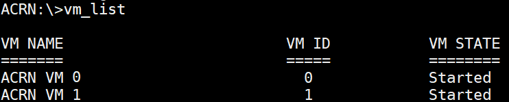

   vm_list information

vcpu_list
=========

``vcpu_list`` provides information about virtual CPUs (vCPU), including
the VM ID, PCPU ID, VCPU ID, VCPU ROLE (primary or secondary), and VCPU
STATE (init, paused, running, zombie or unknown).

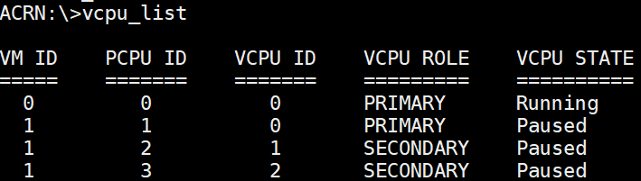

   vcpu_list information

vcpu_dumpreg
============

``vcpu_dumpreg vmid cpuid`` provides vCPU related information such as
registers values, etc.

In the following example, we dump vCPU0 RIP register value and get into
the SOS to search for the currently running function, using these
commands::

   cat /proc/kallsyms | grep RIP_value

As you can see, vCPU0 is running in
function ``acpi_idle_do_entry``.

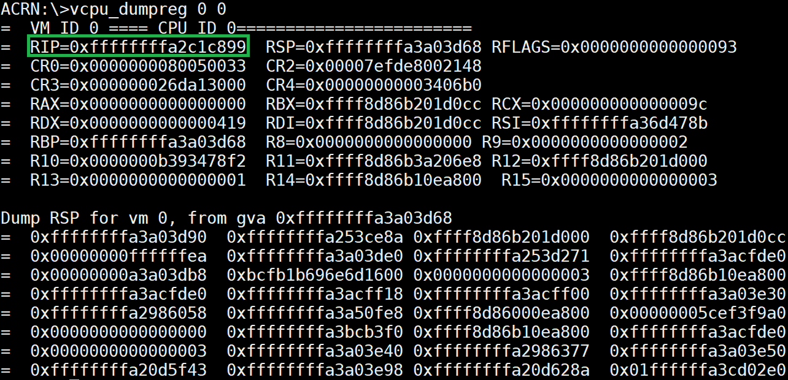

   vcpu_dumpreg information

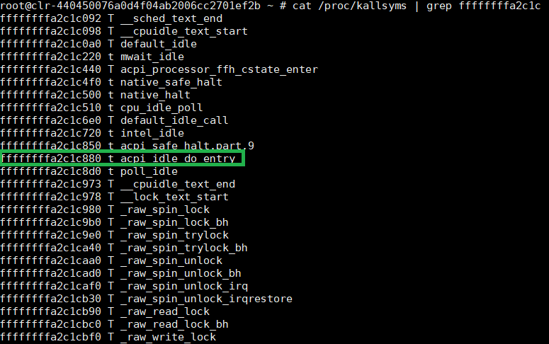

   system map information

dumpmem
=======

``dumpmem mem_address`` provides the specified memory target data such as
the physical CPU (pCPU) number, etc.

In this example, we know the pCPU active bitmap and physical CPU number
physical memory address through
``build/hypervisor/acrn.map``. (Note that the path for
``acrn.map`` depends on how we build the hypervisor.)

Then we can dump the memory address of the pCPU active bitmap and CPU
number, we will know that pCPU active bitmap is 0x000000000000000f and
pCPU number is 0x0000000000000004.

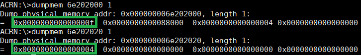

   dumpmem information

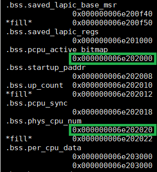

   acrn map information

vm_console
===========

The ``vm_console`` command switches the ACRN's console to become the VM's console.
Use a :kbd:`Ctrl-Spacebar` to return to the ACRN shell console.

vioapic
=======

``vioapic <vm_id>`` shows the virtual IOAPIC information for a specific
VM. In the following figure, we show the virtual IOPIC information for
VM1:

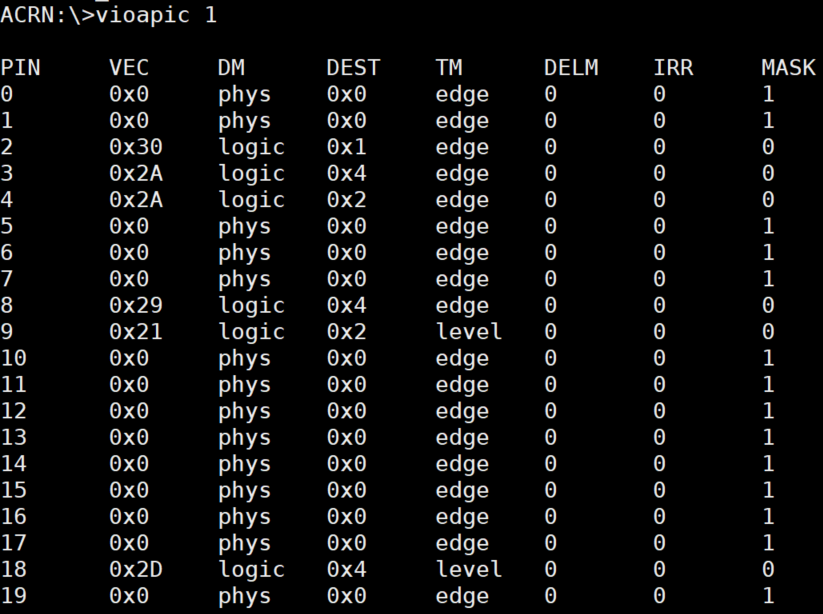

   vioapic information

dump_ioapic
===========

``dump_ioapic`` provides IOAPIC information and we can get IRQ number,
IRQ vector number, etc.

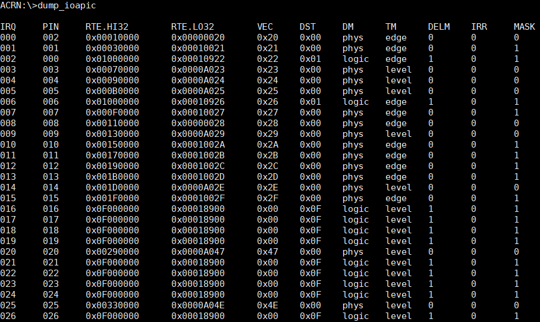

   dump_ioapic information

pt
==

``pt`` provides pass-through detailed information, such as the virtual
machine number, interrupt type, interrupt request, interrupt vector,
trigger mode, etc.

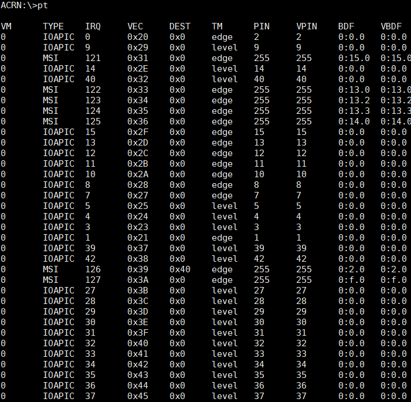

   pt information

int
===

``int`` provides interrupt information on all CPUs and their corresponding
interrupt vector.

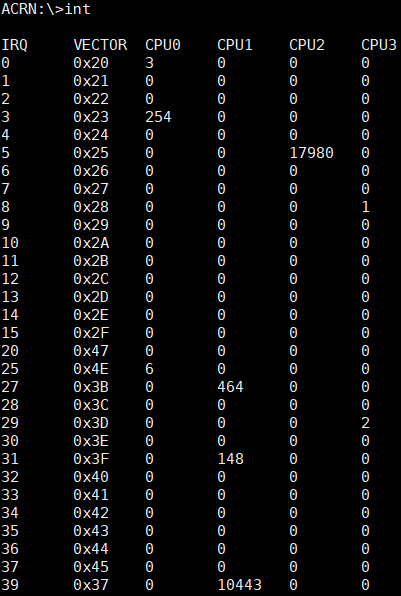

   int information

cpuid
=====

``cpuid <leaf> [subleaf]`` provides the CPUID leaf [subleaf] in
hexadecimal.

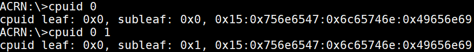

   cpuid information

rdmsr
=====

We can read model specific register (MSR) to get register
values through ``rdmsr [-p<pcpu_id>] <msr_index>``.

In the following example, we can get IA32_APIC_BASE value of pCPU 0 through
the command::

   rdmsr -p0 1b

and see that 1B (Hexadecimal) is the IA32_APIC_BASE MSR address.

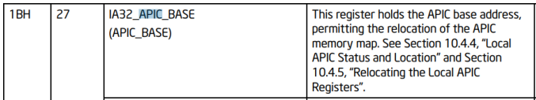

   IA32_APIC_BASE register information

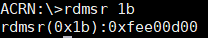

   rdmsr information

wrmsr
=====

We can write model specific register (MSR) to set register
values through ``wrmsr [-p<pcpu_id>] <msr_index> <value>``.

In the following example, we can set IA32_APIC_BASE value of pCPU 1 through
the command::

   wrmsr -p1 1b 0xfee00c00
